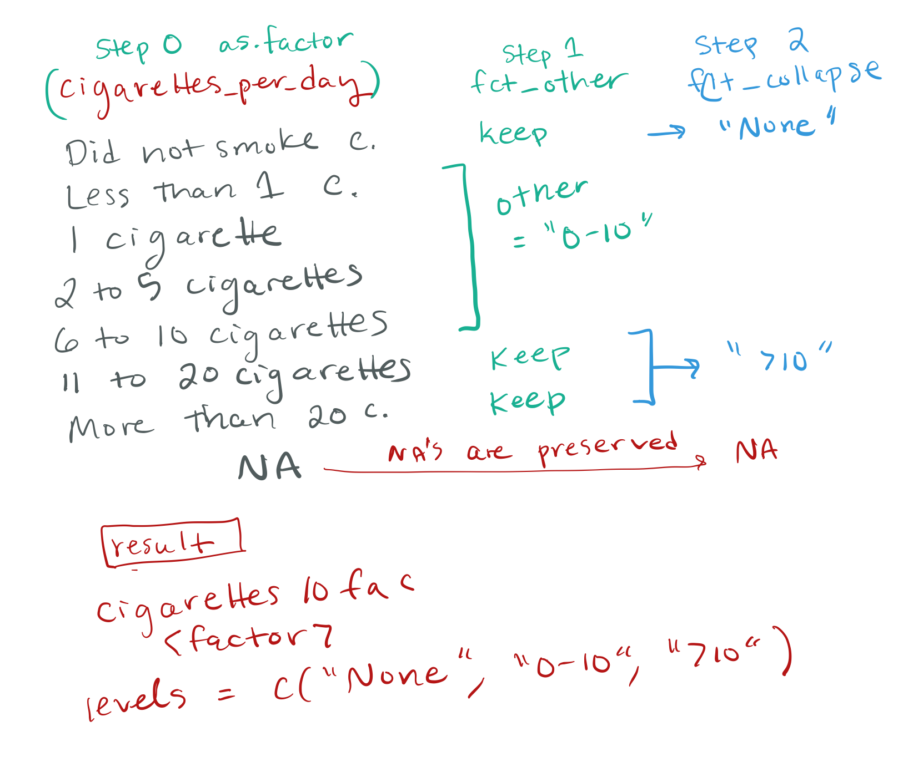
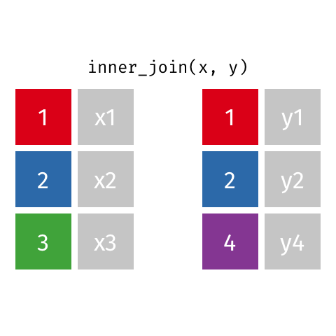
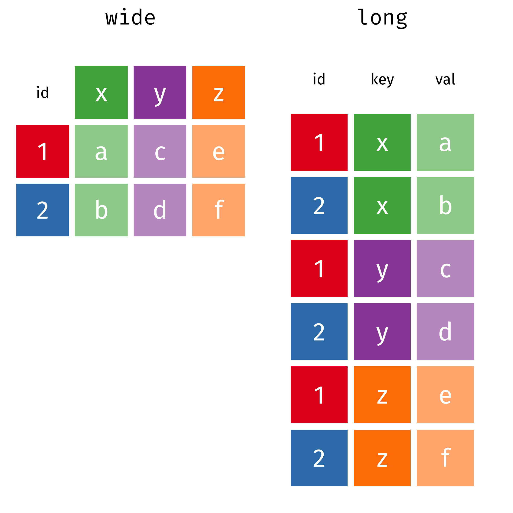
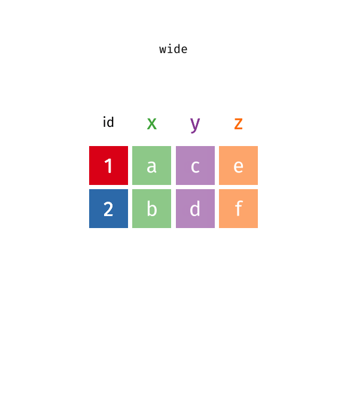

```{r}
#| label: setup
#| include: false
# The first chunk is special 
# because if you try to run a chunk below without running anything else first, 
# R will automatically run this first

knitr::opts_chunk$set(echo = TRUE, fig.path = "output_figs/")

# Here I am loading libraries/packages and installing packages you don't have yet. Add the argument `update=TRUE` if you want to update your packages.
pacman::p_load(
  vembedr,      # youtube embedder
  skimr,        # get overview of data
  tidyverse,    # data management + ggplot2 graphics 
  readxl,       # import excel data
  gtsummary,    # summary statistics and tests
  ggthemes,     # lots of themes
  here,         # helps with file management
  janitor,      # for data cleaning, making tables
  palmerpenguins, # penguin data
  ghibli,       # studio ghibli palettes
  paletteer,    # additional ggplot2 palettes
  gt,           # beautiful tables
  rstatix,      # summary stats for numeric vars
  naniar        # missing values exploration
  )

# set ggplot theme for slides 
# theme_set(theme_bw(base_size = 22))
theme_update(text = element_text(size=22))  # set global text size for ggplots

```


# Welcome to R Programming: Part 5!

Today we will cover creating new variables and summarizing existing variables. 

<br>

Before you get started:

>Remember to save this notebook under a new name, such as `part_05_b526_YOURNAME.qmd`.

<br>

-   Load the packages & `smoke_complete.xlsx` data in the setup code chunk

## Learning Objectives

-   **Learn** and **apply** loading comma separated and tab separated datasets using the `readr` package
-   **Learn** different techniques for cleaning data using functions from the `tidyr`, `forcats`, and `stringr`packages
    -   **Practice** cleaning data with a real dataset
-   **Learn** and **apply** `bind_rows()` to combine rows from two or more datasets
-   **Learn** about ways to merge columns from different datasets
    -   **Apply** `inner_join()` and `left_join()` to merge columns from different datasets
-   **Learn** about wide vs long data and how to reshape data
    -   **apply** `pivot_longer()` to make a *wide* dataset *long*

# Overview

::: {.columns}
::: {.column width="50%"}
-   §0: Read in data files
    -   questionnaire data (1 file)
    -   demographics data (3 files for different time periods)
-   §1 Wrangle **questionnaire data**
    -   Goal 1: group `cigarettes_per_day` into 3 categories
        -   `case_when()`, `fct_collapse()`, `fct_other()`
    -   Goal 2: remove rows with `NA`s with `drop_na()`
:::
::: {.column width="50%"}
-   §2 Wrangle **demographics data**
    -   Merge together (stack) the 3 files with `bind_rows()`
    -   Clean `age_and_grade`
        -   separate into two columns
        -   make values numeric (`stringr` package)
-   §3 Join questionnaire and demographics data  
-   Making data long or wide
:::
:::


# (§0) Reading in csv and other deliminated files

## About the data YRBSS

-   Today we are moving away from the smoking data to use a new somewhat "messier" data set from the CDC's [Youth Risk Behavior Surveillance System (YRBSS)](https://www.cdc.gov/yrbs/about/index.html){target="_blank"}.
    -   From webpage: "measures health-related behaviors and experiences that can lead to death and disability among youth and adults"
-   The data we are working with are a subset of data that are available in the R package [yrbss](https://github.com/hadley/yrbss){target="_blank"}.
    -   This subset of the package's data have *intentionally been made messy and broken into pieces* for us to practice common data cleaning steps and joining different data tables together.
    -   *Note this sub-sample is actually from survey data, and we are ignoring the sampling weights since we aren't really focused on analysis right now. So if you try to look at any associations between variables, don't believe what the data is telling you!*

## Loading plain text files 

-   Previously: Excel files
    -   We've usually been reading in Excel files, which is a very common way to save data.
-   It's actually preferred to save data as **plain text files** so that you don't need a proprietary software (i.e. Excel) to open them, and they are more universal.
-   Common plain text files include 
    -   `.csv` (columns are comma separated values) 
    -   `.tsv` (columns are tab separated values)
    -   Check out the `csv` and `tsv` files in the `data` folder.
-   We'll be using functions from the `readr` package: 
    -   `read_csv()`, `read_tsv()`, `read_delim()`

## Load the 3 demographic data files

-   `yrbss_demo_1991.tsv`
-   `yrbss_demo_1993to2007.csv`
-   `yrbss_demo_2009to2013.csv`

::: {.panel-tabset}
### tsv: `read_tsv()` or `read_delim()`

```{r}
#| message: true

# data from one year, 1991, tsv (tab separated) file
yrbss_demo_1991 <- read_tsv(
  file = here("part5", "data","yrbss_demo_1991.tsv"))

# we can also use read_delim and specify the delimiter that separates fields
yrbss_demo_1991 <- read_delim(
  file = here("part5", "data","yrbss_demo_1991.tsv"),
  delim = "\t" # tab delimiter
  )
```

### csv: `read_csv()`

```{r}
#| message: true

# data from 1993-2007, csv file
yrbss_demo_1993to2007 <- read_csv(
  file = here("part5", "data","yrbss_demo_1993to2007.csv"))

# data from 2009-2013, csv file
yrbss_demo_2009to2013 <- read_csv(
  file = here("part5", "data","yrbss_demo_2009to2013.csv"))

```
:::

## Challenge 1 (\~5 minutes)

1.  Load the data file "yrbss_questions.csv" using `here()` and save it as the object `yrbss_questions`.

```{r}

```

2.  Use the `clean_names()` function to clean up the names of `yrbss_questions`, and then rename the columns so that they are as follows:
    -   record, year, bicycle_helmet, text_driving, ever_smoked, age_first_smoked, days_smoked, cigarettes_per_day, ever_been_bullied

```{r}

```

3.  For `yrbss_questions`, make a cross table (2-way table) of `cigarettes_per_day` and `ever_smoked`. Do you see anything unusual or unexpected?

```{r}

```


# (§1) Wrangle questionnaire data `yrbss_questions`

<br>

-   Goal 1: group `cigarettes_per_day` into 3 categories
-   Goal 2: remove rows with `NA`s with `drop_na()`


## Load the questionnaire data

The code below is loading the data from Challenge 1.

```{r}
#| message: true

yrbss_questions <- 
  read_csv(file = here("part5", "data", "yrbss_questions.csv")) %>% 
  clean_names() %>% 
  rename(
    bicycle_helmet = how_often_wear_bicycle_helmet,
    text_driving = ever_text_while_driving_in_past_30_days,
    age_first_smoked = how_old_when_first_smoked,
    days_smoked = how_many_days_smoked_in_past_30_days,
    cigarettes_per_day = how_many_cigarettes_day_in_past_30_days
  )
 
```

## Goal 1: group `cigarettes_per_day` into 3 categories

-   Let's group the cigarettes per day column into three categories:
    -   "None", "0-10", ">10" cigarettes per day.
-   Below we do this in different ways:
    -   Using `case_when()`
    -   Using factor functions from the `forcats` package

```{r}
# what are the current categories?
yrbss_questions %>% tabyl(cigarettes_per_day)

```

## Goal 1 with `case_when()`

-   Use `case_when()` to group the cigarettes per day column into three categories:
    -   "None", "0-10", "\>10" cigarettes per day.

::: {.panel-tabset}
### Attempt 1

*Why does this code not work as intended?*

```{r}
# note that we're not saving this attempt
yrbss_questions %>%      
  mutate(
    cigarettes10 = case_when(
      cigarettes_per_day == "Did not smoke cigarettes" ~ "None",
      cigarettes_per_day %in% 
        c("11 to 20 cigarettes", "More than 20 cigarettes") ~ ">10",
      .default = "0-10"
      ),
    cigarettes10 = factor(
      cigarettes10,
      levels = c("None","0-10",">10")) # make sure levels are in order
    ) %>%
  tabyl(cigarettes_per_day, cigarettes10) %>%
  adorn_title()
```


### Attempt 2

```{r}
# this time we're saving our changes:

yrbss_questions <- yrbss_questions %>% mutate(
  cigarettes10 = case_when(
    cigarettes_per_day == "Did not smoke cigarettes" ~ "None",
    cigarettes_per_day %in% 
      c("11 to 20 cigarettes", "More than 20 cigarettes") ~ ">10",
    is.na(cigarettes_per_day) ~ NA, # need to specify NA type
    # is.na(cigarettes_per_day) ~ as.character(NA), # also would work
    TRUE ~ "0-10"
  ),
  cigarettes10 = factor(
    cigarettes10,
    levels = c("None","0-10",">10")) # make sure levels are in order
) 

yrbss_questions %>%
  tabyl(cigarettes_per_day, cigarettes10) %>%
  adorn_title()
```

###   Note on `NA`

-   Starting with `dplyr 1.1.0` we no longer need to specify the type of `NA` 
    -   such as `NA_character_`, `NA_real_`, or `NA_integer_`       
-   See [presentation](https://www.youtube.com/watch?v=K_7UJA2syLk&list=PL9HYL-VRX0oRFZslRGHwHuwea7SvAATHp&index=32&t=7s){target="_blank"} on the new easier to use `case_when()` from posit::conference 2023, starting at 0:31.

<br>

Back in the old days we had to be careful... and you will likely still see `case_when()` examples on the internet using `NA_character_`, `NA_real_`, or `NA_integer_`

-   See this [webpage](https://github.com/tidyverse/dplyr/issues/3202){target="_blank"} for discussion of `NA`types when using`case_when()`.


:::

## Goal 1 with factors using `forcats`

-   Use factor functions from the `forcats` package to group the cigarettes per day column into three categories:
    -   "None", "0-10", "\>10" cigarettes per day.

-   I encourage you to look at the intro to `forcats` vignette and cheatsheet [here](https://forcats.tidyverse.org/){target="_blank"}.

-   Instead of using `case_when()`,
    -   we could instead *collapse* the cigarettes per day column into three categories by creating a factor, and 
    -   using the handy `forcats` functions `fct_collapse()` and `fct_other()`.

*Note: This is a somewhat contrived demonstration of how to use `fct_collapse` and `fct_other` together so you can see what each of these functions does, but you could also just use `fct_collapse()` by itself.*

```{r}
yrbss_questions %>% tabyl(cigarettes_per_day)
```


## Steps 1 & 2: `fct_other()` to create the `0-10` factor level

```{r}
yrbss_questions <- yrbss_questions %>%
  mutate(
    # step 1: make cigarettes_per_day a factor
    cigarettes_per_day = factor(cigarettes_per_day),
    #
    # step 2: create an other group called "0-10" for the many 0-10 cig/day levels
    cigarettes10fac =
      fct_other(
        cigarettes_per_day,
        # specify levels to keep (there's also a drop option)
        keep = c(
          "Did not smoke cigarettes",
          "11 to 20 cigarettes",
          "More than 20 cigarettes"
        ),
        # specify name for collapsed remaining levels
        other_level = "0-10"  # default is "Other" if not specified
      )
  )

# check what happened
yrbss_questions %>%
  tabyl(cigarettes_per_day, cigarettes10fac) %>%
  adorn_title()
```

## Step 3: `fct_collapse()` to create the `None` and `>10` factor levels

```{r}
yrbss_questions <- yrbss_questions %>%
  mutate(
    # step 3: create "None" level and collapse the two "top" levels to one ">10" category
    cigarettes10fac =
      fct_collapse(
        cigarettes10fac,
        "None" = "Did not smoke cigarettes",
        ">10" = c("11 to 20 cigarettes", "More than 20 cigarettes")
      ))

# check what happened
yrbss_questions %>%
  tabyl(cigarettes_per_day, cigarettes10fac) %>%
  adorn_title()

# we could have done all of this with fct_collapse, with a tiny bit more typing
```

## Steps 1-3 Visual representation

{fig-align="center" width="100%"} 


## Goal 2: remove rows with `NA`s with `drop_na()`

> Note that below we do not remove any rows with missing data from `yrbss_questions`. All changes are saved to a different tibble.

-   If we want to remove rows that have missingness, we can use the `drop_na()` function.
-   We can choose to
    -   remove rows that have missingness only in a certain column or columns, or
    -   we can remove rows that have missingness in *any* column.
-   See the [`drop_na()`](https://tidyr.tidyverse.org/reference/drop_na.html){target="_blank"} reference for examples.

##  `drop_na()` to remove rows with NA

::: {.panel-tabset}

### Which vars have NA?

```{r}
nrow(yrbss_questions)
# from the naniar package:
miss_var_summary(yrbss_questions)

```

### `bicycle_helmet` 

```{r}
# remove rows with missing bicycle_helmet:
tmpdata <- yrbss_questions %>% 
  drop_na(bicycle_helmet) 
nrow(tmpdata)             # how many rows left?
miss_var_summary(tmpdata) # which rows do not have NA?
```

### smoking data

```{r}
# remove rows with missing smoking data
tmpdata <- yrbss_questions %>% 
  drop_na(ends_with("smoked")) 
nrow(tmpdata)             # how many rows left?
miss_var_summary(tmpdata) # which rows do not have NA?

```

### Remove all `NA`

```{r}
# remove rows with any missing data
tmpdata <- yrbss_questions %>% 
  drop_na() 
nrow(tmpdata)             # how many rows left?
miss_var_summary(tmpdata) # which rows do not have NA?

```

:::


# (§2) Wrangle demographics data

-   Merge together (stack) the 3 files with `bind_rows()`
-   Clean `age_and_grade`
    -   separate into two columns
    -   make values numeric (`stringr` package)


# Stack multiple datasets with `bind_rows()`

## When do we stack data?

-   Often we have data from multiple sources that we need to combine into one data frame.
    -   In the most simple scenario, the data are measuring the same or similar things and are from different and distinct populations, i.e. from different labs, different clinics, etc.
-   In this case, we have YRBSS demographic data from 3 different ranges of sampling years.
    -   They represent data from 3 different cohorts of students across different times (no overlapping student record ids! This is an important detail).
-   **Goal: stack the data on top of each other into one long data set that contains every year's data.**
-   To do this we can use the `dplyr` function `bind_rows()`.

## Our 3 datasets to stack

Let's look at our three data sets:

```{r}
glimpse(yrbss_demo_1991)
```

```{r}
glimpse(yrbss_demo_1993to2007)
```

```{r}
glimpse(yrbss_demo_2009to2013)
```

## Stack 1991 and 1993-2007 data

-   We'll start by binding together/stacking the data from 1991 and 1993-2007.
-   First, let's check those column names again:

```{r}
colnames(yrbss_demo_1991)
dim(yrbss_demo_1991)
colnames(yrbss_demo_1993to2007)
dim(yrbss_demo_1993to2007)
```

-   We can see that BMI and weight are missing from the 1991 data.
-   But `bind_rows()` still works as intended, filling in `NA` values in those columns.

```{r}
yrbss_demo_1991to2007 <- bind_rows(yrbss_demo_1991, 
                                   yrbss_demo_1993to2007)

# note we now have 9000 rows, which is the sum of the 1000 and 8000 rows above
glimpse(yrbss_demo_1991to2007)
```

Let's check we have data from the years we want:

```{r}
yrbss_demo_1991to2007 %>% 
  tabyl(year)
```

## Stack 1991-2007 with 2009-2013 data

-   Now we want to combine this dataset and the 2009-2013 data.

::: {.panel-tabset}

### datasets

-   Let's check out their info first:

```{r}
colnames(yrbss_demo_1991to2007)
dim(yrbss_demo_1991to2007)
colnames(yrbss_demo_2009to2013)
dim(yrbss_demo_2009to2013)
```

-   Uh oh, these datasets have different names for the same thing.
-   Also, the columns are all out of order!

### take 1

-   If we try to bind them together, what happens?

```{r}
bind_rows(yrbss_demo_1991to2007, yrbss_demo_2009to2013) %>% glimpse()
```

-   Yikes.
    -   What extra columns do we have?
    -   What matched and what didn't?

### match names

**We need to first do some data cleaning!**

-   Let's make sure our names in the 2009-2013 data match the first dataset's column names.
    -   First use `janitor::clean_names` to make things a little cleaner:

```{r}
yrbss_demo_2009to2013 <- yrbss_demo_2009to2013 %>% 
  clean_names()

colnames(yrbss_demo_2009to2013)

yrbss_demo_2009to2013 <- yrbss_demo_2009to2013 %>%
  rename(race4 = race_4_cat,
         race7 = race_7_cat,
         bmi = bmi_kg_m_2)


# look at the column names now:
colnames(yrbss_demo_1991to2007)
colnames(yrbss_demo_2009to2013)

# or, for a side-by-side comparison using cbind (column bind)
cbind(names(yrbss_demo_1991to2007), names(yrbss_demo_2009to2013))

# we can check that we changed all the names to match names in the other data
colnames(yrbss_demo_2009to2013) %in% colnames(yrbss_demo_1991to2007)

sum(colnames(yrbss_demo_2009to2013) %in% colnames(yrbss_demo_1991to2007))
```


-   Looks like all the names are the same, but they are still out of order.
-   This is ok! `bind_rows()` will use the ordering from the first data set, and knows how to match them up since they have identical names.

### take 2

Now let's bind the data:

```{r}
yrbss_demo <- bind_rows(yrbss_demo_1991to2007, 
                        yrbss_demo_2009to2013)

# we could also do this with the pipe
yrbss_demo <- yrbss_demo_1991to2007 %>%
  bind_rows(yrbss_demo_2009to2013)

glimpse(yrbss_demo)

# check the years in the data:
yrbss_demo %>% tabyl(year)
```

😃 Success!  

:::

## Examine the stacked data

-   Before we start with the data cleaning, we need to acquaint ourselves with the data:

```{r}
glimpse(yrbss_demo)

# quick summary of the data
gtsummary::tbl_summary(yrbss_demo)
```

All of these columns look pretty standard except age and grade. What even is?


# Create `age` and `grade` columns 

-   Goal: create two separate numeric columns with just that ages and grades

```{r}
yrbss_demo %>% tabyl(age_and_grade)
```

## Separate `age_and_grade` into `age` and `grade`

-   Ok, yes, this combined column was combined on purpose, so that we can introduce the very useful function `separate_wider_delim()`.
-   Check out `?separate_wider_delim`.
    -   Until recently this function was known as just `separate()`, which has been *superseded* with `separate_wider_delim() and `separate_wider_position().


> `separate_wider_delim()`: Split a string into columns by delimiter

-   In our case, age and grade were merged together with a semicolon (;)
    -    which makes it easy to split into two columns
-   Note that these data are NOT "tidy" because they contain two pieces of information in one column. Let's make them tidy.

(*Side note: the opposite of `separate_wider_delim()` is `unite()`, look at some examples of this.*)

## `separate_wider_delim()`


::: {.panel-tabset}

### R code

```{r}
yrbss_demo <- yrbss_demo %>%
  separate_wider_delim(
    # the column we are separating
    cols = age_and_grade,
    
    # names of new columns, we know we need two columns, but this can be variable!
    names = c("age", "grade"),
    
    # delimiter to separate into two columns
    delim = ";",
    
    # keep the original column
    cols_remove = FALSE 
    ) %>%
  
  # make sure "NA" turns into R's missing NA value
  mutate(age = na_if(age, "NA"),
         grade = na_if(grade, "NA"))
```


### glimpse

-   That's a start. We now have tidy data in the sense that each cell has one piece of information in it.
-   However, both age and grade are character vectors, but we want them to be numeric.

```{r}
glimpse(yrbss_demo)
```


### Check 1

```{r}
yrbss_demo %>% tabyl(age_and_grade, age) %>% adorn_title()
```


### Check 2

```{r}
yrbss_demo %>% tabyl(age_and_grade, grade) %>% adorn_title()

```

:::


# Working with text: `stringr` package

-   Both of the age and grade columns are character vectors with "extra text", and there's a tidyverse package that is ALL about working with characters or "strings", called `stringr`.
    -   It's automatically loaded when you load the `tidyverse` package (`library(tidyverse)` or `pacman::p_load(tidyverse)`).
    -   I highly recommend that you read the introduction to `stringr` [vignette](https://cran.r-project.org/web/packages/stringr/vignettes/stringr.html){target="_blank"} and look at the [cheatsheet](https://stringr.tidyverse.org/index.html){target="_blank"}.

## Goal 1: clean the `grade` variable

For the column grade, we can see that the values are numbers followed by "th":

```{r}
yrbss_demo %>% tabyl(grade)
```

::: {.panel-tabset}
### `str_remove_all()`

We can remove that string with the function `str_remove_all()`:

```{r}
yrbss_demo <- yrbss_demo %>%
  mutate(grade_num = str_remove_all(grade, "th") )

yrbss_demo %>% tabyl(grade_num, grade) %>% adorn_title()
```

-   We successfully removed `th` from those values,
    -   however, `grade_num` is still character type:

```{r}
glimpse(yrbss_demo)
```

### `as.numeric()` info

-   We want grade to be a numeric variable, and we can use `as.numeric` to change the character vector of numbers into a numeric vector of numbers.

-   See how `as.numeric()` works:

```{r}
c("1", "2", "3", NA)
as.numeric(c("1", "2", "3", NA))
```

-   Careful, though, we will get a warning if there are `NA` values "introduced by coercion" which means some of our character values are not obviously numbers!
    -   See example below.
    -   (Side note: this is how I realized I needed the `na_if()` statements above to convert "NA" to `NA` in age and grade).

```{r}
c("1", "2", "3", NA, "a")
as.numeric(c("1", "2", "3", NA, "a"))
```

-   It's a good idea to use `tabyl()` on your character string first before converting to numeric, to make sure there are no surprises,
    -   and a cross-`tabyl` after to double check it worked properly.


### apply `as.numeric()`

```{r}
yrbss_demo <- yrbss_demo %>%
  mutate(grade_num = as.numeric(grade_num))

yrbss_demo %>% tabyl(grade, grade_num) %>% adorn_title()

glimpse(yrbss_demo)
```

:::

## Goal 2: clean the `age` variable

```{r}
yrbss_demo %>% tabyl(age)
```

-   We see that there are some complications:
    -   ≤ 12 are grouped together and 
    -   ≥ 18 are grouped together.
-   Let's pretend that we want the categories to just be the numeric values 12-18, 
    -   so group ≤ 12 as 12, and group ≥ 18 as 18.
    -   Obviously this isn't ideal, but for learning purposes let's do this.
-   There are several ways to do that (including using `case_when()` for example, or even `separate_wider_delim()`), but let's use the `stringr` package first.

## G2 Option 1: `str_remove_all()` to clean `age`

::: {.panel-tabset}
### Attempt 1

```{r}
# try removing the string " years old"
yrbss_demo %>% 
  mutate(
    age_num = str_remove_all(age, " years old")
    ) %>%
  tabyl(age_num) # almost there
```

### Attempt 2

```{r}
# remove all the strings manually
yrbss_demo %>% 
  mutate(
    age_num = str_remove_all(age, " years old"),
    age_num = str_remove_all(age_num, " or younger"),
    age_num = str_remove_all(age_num, " or older")
    ) %>%
  tabyl(age_num) # looks good, now we just need to make it numeric
```

### Attempt 3 🥳

```{r}
# remove all the strings manually & make age numeric
yrbss_demo %>% 
  mutate(
    age_num = str_remove_all(age, " years old"),
    age_num = str_remove_all(age_num, " or younger"),
    age_num = str_remove_all(age_num, " or older"),
    age_num = as.numeric(age_num)
    ) %>%
  tabyl(age_num) # perfect
```

:::

## G2 Option 2: `str_remove_all()` with regex 

-   Regex (short for *regular expressions*) is a way to search strings using special syntax.

::: {.panel-tabset}
### Remove all letters `"[a-z]"`

-   We could have removed all of the alphabet letters in one step with regex:

```{r}
# remove all the alphabet using regex
yrbss_demo %>% 
  mutate(
    age_num = str_remove_all(age, "[a-z]"),
    age_num = as.numeric(age_num)
    ) %>%
  tabyl(age_num) 
```

### Remove specified words

-   Or, we can remove specific words with regex (recall `|` means or):

```{r}
# remove a set of words with regex |
yrbss_demo %>% 
  mutate(
    age_num = str_remove_all(age, "years|old|or|younger|older"),
    age_num = as.numeric(age_num)
    ) %>%
  tabyl(age_num) 
```

-   **What went wrong with the code above?**
    -   How do we fix it?


:::

## G2 Option 3: Clever separate for `age`

We could have used `separate_wider_delim` by being a bit clever!

::: {.panel-tabset}

### `age` "separator"?

What to use as the "separator" to keep the numbers in their own column?

```{r}
yrbss_demo %>% tabyl(age)
```

### separate age column

```{r}
yrbss_demo %>% 
  separate_wider_delim(
    cols = age, 
    names = c("age_num","old"),
    delim = " years",  # our data has this phrase after the number
    cols_remove = FALSE # keep the age column
    ) %>%
  glimpse()
```

### save changes to yrbss_demo

```{r}
# separate, and let's reassign it to yrbss_demo this time
yrbss_demo <- yrbss_demo %>% 
  separate_wider_delim(
    cols = age, 
    names = c("age_num","old"),
    delim = " years", 
    cols_remove = FALSE # keep the age column
    ) %>%
  mutate(age_num = as.numeric(age_num)) %>%
  select(-old) # remove the old column that we do not need

```

### Checks

```{r}
yrbss_demo %>% tabyl(age, age_num) # yep!
glimpse(yrbss_demo)

```


:::

## G2 Option 4: `parse_number()` to clean `age`

::: {.columns}
                                        
::: {.column width="35%"}
](image/horst_parse_number.png){width="100%"}

:::
                                          
::: {.column width="65%"}
-   `parse_number()` "parses the **first number** it finds, dropping any non-numeric characters before the first number and all characters after the first number."
    -   Copied from [help file](https://readr.tidyverse.org/reference/parse_number.html){target="_blank"}.
-   `parse_number()` is from the `reader` package, which gets loaded as a one of the [core `tidyverse` packages](https://www.tidyverse.org/packages/#core-tidyverse){target="_blank"} when `tidyverse` is loaded.

:::
                                          
:::

::: {.panel-tabset}


### R code

```{r}
glimpse(yrbss_demo)

yrbss_demo <- yrbss_demo %>% 
  mutate(age_parse = parse_number(age))
```

### check

```{r}
# check:
yrbss_demo %>% tabyl(age, age_parse) %>% adorn_title()

glimpse(yrbss_demo) # age_parse data type?
```

-   Note that `age_parse` is already a numeric variable!
:::


## Challenge 2 (\~10 minutes)

1.  For `yrbss_demo`, use `separate_wider_delim()` to split the column grade into two columns by the letter `t`, that is, "12th" would become "12" and "h", then remove that second column and convert the grade number column from a character column into a numeric column. Check your work with `tabyl()`.

```{r}

```

2.  For `yrbss_demo`, use `str_replace_all()` to replace the appropriate characters to change 
    -   "Am" to "American" in the category "Am Indian / Alaska Native", and 
    -   "PI" to "Pacific Islander" in the "Native Hawaiian/other PI" category. 
    -   Check your work with `tabyl()`.

```{r}

```


# (§3) Join questionnaire and demographics data

Now that we've wrangled the questionnaire and demographics datasets, we're ready to merge (join) them together.


-   We have data on patients from two sources:
    -   one contains demographics,
    -   the other contains answers to survey questionnaires.
-   How do we combine these two data sets into one table?

## Naming conventions

{fig-align="center" width="50%"}

-    Whenever we join two tables, we will have
    -   a `left table` (in this case, the `x` table) and
    -   a `right table` (in this case, the `y` table).
-   `key`:
    -   In order to join the two tables, we have to somehow map the rows of our left table (`x`) with the rows of our other table (`y`).
    -   We do this by joining together rows with a common variable.
    -   In our case, we need to join rows based on the first column in both tables.
    -   **The column that we join on is called a *key*.**


::: {.callout-note}
In the above example, we see that there is a row in `x` whose *key* is 2, and there is a row in `y` whose *key* is 2 as well. So it makes sense to join these two rows together into one row.

So, by matching the rows with identical keys, we can put together a table that incorporates information from both tables.

:::


## Types of joins


::: {.columns}
                                        
::: {.column width="50%"}
-   There are several different types of joins:
    -   inner join
    -   left join
    -   right join
    -   full join
    -   anti join

The most common usages require an inner join, a left join, or a full join.
:::
                                          
::: {.column width="50%"}
](image/dplyr_join_venn.png){fig-align="center" width="60%"} 
:::
                                          
:::


## Inner Joins

::: {.columns}
                                        
::: {.column width="50%"}
{fig-align="center" width="100%"}
:::
                                          
::: {.column width="50%"}
-   With an inner join, we only keep rows that have matching *keys* in both tables.

<br>

-   If there is no match in both tables, we don't include the row with that key.
    -   In the example to the left, we don't keep row 3 in table x or row 4 in table y.

:::
:::


## Joining Syntax


```{r}
#| eval: false

inner_join(
  table_x, 
  table_y,
  join_by(key_column_x == key_column_y)
  )
```


-   We first specify the left table (`table_x`) and then the right table (`table_y`).
-   Note the `join_by` argument. 
    -   This is the argument where we specify which column in each table contains our key.

<br>

**Older R code syntax**


```{r}
#| eval: false

inner_join(
  table_x, 
  table_y,
  by = c("key_column_x" = "key_column_y")
  )
```


## The more `dplyr` way to do joins

The more `dplyr` way to do joins is below:

```{r}
#| eval: false

#start with left table
table_x %>% 

  #join left table with right table
  inner_join(
    y = table_y, 
    
  #point out the key column in each table
    join_by(key_column_x == key_column_y)
  )
```

-   We start with our *left* table, `table_x`.
-   The main difference is that we don't need to specify the `x` argument in `inner_join()`, because we are piping `table_x` as the first argument of `inner_join()`.

## Full Joins

::: {.columns}
                                        
::: {.column width="50%"}
{fig-align="center" width="100%"}
:::
                                          
::: {.column width="50%"}

-   A full join keeps all the data from both tables.

-   You could use this as your default join, and then filter your data how you want it later. However, I tend to use `left_join` the most.

-   When there is no information from the left or right table, these rows will have an `NA`. That is, the information is missing for the columns that come from the other table.

:::
:::


## Left Joins

::: {.columns}
                                        
::: {.column width="50%"}
{fig-align="center" width="100%"}
:::
                                          
::: {.column width="50%"}
-   In a *left join*, we keep all the rows in the left table regardless of whether there is a match in the right table.

-   In the example to the left, we keep row 3 in table x even though it doesn't have a match in table y.

    -   Because there is no information from the right table, these rows will have an `NA`. That is, the information is missing for the columns that come from the right table.

-   I usually think of my **left table as defining my study cohort**. I only want to keep data on subjects in my left table, and the rest are not useful.
:::
:::

## Toy example

*   Say we have a set of patients for whom we want to join their demographic information with their lab data, in particular their white blood cell count (WBC).
*   We also need to know whether there are patients in our set who haven't gotten a WBC.
*   Because the lab system isn't part of the electronic health record, we'll need to make a join on the patient table to the lab table.

```{r}
patient_table <- read_excel(here("part5", "data", "patient_example.xlsx"), sheet = 1)

wbc_table <- read_excel(here("part5", "data", "patient_example.xlsx"), sheet = 2)
```

Let's look at `patient_table`, which we'll use as our *left table*:

```{r}
patient_table
```

Here is `wbc_table`, which we'll use as our *right table*:

```{r}
wbc_table
```

*   Below we join the data with an `inner_join()`. 
    *   Why was an `inner_join()` chosen instead of the other join options?

```{r}
patient_table %>%
  inner_join(y = wbc_table,
             join_by(patient_id == patient_id)
             )

```


## When do we use which join?

See this [two-table verbs vignette](https://dplyr.tidyverse.org/articles/two-table.html){target="_blank"} and this [cheatsheet](https://stat545.com/join-cheatsheet.html){target="_blank"} for some extra explanations.

These joins are created to match SQL joins for databases.

-   `inner_join` = You only want rows that are in *both* tables
-   `left_join` = You only want rows that are in one table.
    -   Often the right table is a subset of the left table, so it's easy to use this to keep everything in the bigger table, and join on the smaller table
    -   If the left table contains a cohort of interest, i.e. everyone that has been given a specific treatment, and you want to get their lab values from another table, use `left_join()` to add those lab values in the cohort defined by the left table
-   `right_join` = maybe never
    -   `right_join` does the same thing as `left_join` but backwards, I find left join easier to think about (personal preference)
-   `full_join` = does not remove any rows, you might want to use this as your default and filter later
-   `anti_join` and `semi_join` = [**filtering joins**](https://r4ds.hadley.nz/joins.html#filtering-joins-1){target="_blank"}, probably use rarely,
    -   `anti_join`: use right table as an exclusion criteria and find unmatched keys in left table
    -   `semi_join`: filter left table based on keys in right table, and keep only columns from left table

## Warning

Watch out for duplicated "keys" when you join (multiple observations), or you will end up with duplicated data rows.

-   See *R for Data Science* 1st Ed for a section on [duplicated keys](https://r4ds.had.co.nz/relational-data.html#join-matches){target="_blank"}.

## Your Turn

*   Modify the code below to do a `left_join()` on `patient_table` and `wbc_table`.
    *   Which patient in `patient_table` didn't get a WBC?

```{r}
#| eval: false   # change to true!

patient_table %>%
  inner_join(y = wbc_table,
            join_by(patient_id == patient_id)
            )

```


## Challenge 3: Join the YRBSS data (\~5 minutes)

1.  Use `left_join()` to join `yrbss_questions` and `yrbss_demo` into a dataset called `yrbss_all` so that we retain all data combined into one table. 
    -   Remember, `yrbss_questions` is a random sample of the demographic data, 
    -   so think about which is your left table and your right table.

<br>

2.  Double check your join by looking at `glimpse()`, did you select the right variable to join by?

```{r}


```


# Reshaping data

## Motivation 

The last thing we'll talk about today is the difference between the *wide* data format and the *long* data format.

-   A really common format in bioinformatics is the *expression matrix*.
-   In an *expression matrix*,
    -   the *rows* correspond to different *genes* and
    -   the *columns* correspond to different *samples*.

```{r}
expression_example <- read_csv(here("part5", "data", "expression_example.csv"))

expression_example
```

*Note: TCGA is short for [The Cancer Genome Atlas](https://www.genome.gov/Funded-Programs-Projects/Cancer-Genome-Atlas){target="_blank"}.*

## Why make our data *long*?

*   This format isn't super useful for a lot of data manipulations.

*   It's because the columns correspond to samples, and this prevents us from plotting things like PTEN expression across the samples.

*   This kind of data is in a format that is called **wide** format. What we need to do is collapse the numerical values into a single column.

*   Wide data are typical for *longitudinal* data, where columns correspond to time points. 
    *   Often we need to reshape this data into long format in order to analyze it or plot it, where each row corresponds to an observation of a subject at one time point. 
    *   We would have a column "time" that tells us what time point the observation was taken (i.e. baseline, 6 months, 12 months, etc).

## Wide vs. long data


{fig-align="center" width="50%"}

## The magic of `pivot_longer()`

::: {.columns}
                                        
::: {.column width="40%"}
{fig-align="center" width="100%"}
:::
                                          
::: {.column width="60%"}

`pivot_longer()` is the function that will let us make our *wide* data *long*.

It takes three arguments:

-   `cols` - the columns to collapse. 
    -   We talked about `tidyselect` verbs (the language we use for `select()` and `across()`), and we will use those here to help select columns based on naming criteria. Below we're using the `starts_with()` selector to grab the columns that begin with `tcga`

-   `names_to` - the name of the column where the labels will be consolidated to

-   `values_to` - the name of the column where the values in the columns in the wide data will be consolidated to.

:::
                                          
:::


## R code for `pivot_longer()`

```{r}
expression_example  # wide data

expression_long <- 
  expression_example %>%
    pivot_longer(
      cols= starts_with("tcga"), 
      # column names are moved to a column that we are choosing to call "sample"
      names_to = "sample", 
      # the data points from the "body" of the table are moved to a column 
      # that we are choosing to call "expression"
      values_to = "expression" 
    )

expression_long
```

Below is a different way of selecting the columns:

```{r}
expression_long <- 
  expression_example %>%
    pivot_longer(
      cols= -gene_symbol,  # everything except gene_symbol
      names_to = "sample", # column names are moved to a column called sample
      values_to = "expression" # the data points go to a column called expression
    )

expression_long
```

## ggplot loves long data

-   Creating figures with ggplot works best with long data, so that we can make use of different variables for different specifications in figures.

::: {.panel-tabset}
### Boxplot with fill color

```{r}
#| fig.height: 4
#| fig.width: 8

ggplot(expression_long) +
  aes(x = gene_symbol, 
      y = expression, 
      fill = gene_symbol) +
  geom_boxplot()
```

### Heatmaps with `geom_tile`

```{r}
#| fig.height: 4
#| fig.width: 10

expression_long <- expression_long %>%
  mutate(
    gene_symbol = factor(
      gene_symbol, 
      levels = c("PTEN", "MTOR", "RKIP", "KCNJ9")
      ),
    # use forcats::fct_rev to reverse levels for plotting
    gene_symbol = fct_rev(gene_symbol)
    )

ggplot(expression_long) +
  aes(x = sample, 
      y = gene_symbol, 
      fill = log2(expression)) +
  geom_tile() +
  # new scale! this is a 3 color gradient (low-mid-high)
  scale_fill_gradient2(
    low = "yellow", 
    mid = "white", 
    high = "darkorchid4")

```

:::

## `facet_wrap()` - another reason to make long data!

__Goal: Make a barplot of every categorical column in `yrbss_all`.__

::: {.panel-tabset}

### join the data

```{r}
# from Challenge above, but, making sure we have this joined data
yrbss_all <- left_join(
  yrbss_demo, 
  yrbss_questions, 
  join_by(record_id == record, 
          year == year)
  ) 

glimpse(yrbss_all)
```


### one barplot

We can make an individual barplot of just one variable with `geom_bar()`:


```{r}
#| fig.height: 3
#| fig.width: 10

ggplot(yrbss_all, aes(x=race4)) + 
  geom_bar()
```

:::

## Make the data long

*   If we make the data long(er) we can create many barplots at once for many different variables in the dataset.
*   We will use `pivot_longer()` combined with `facet_wrap()`:

```{r}
yrbss_long <- yrbss_all %>%
  mutate(across(where(is.factor), as.character)) %>%
  pivot_longer(
    cols = where(is.character), # all our character vectors
    names_to = "variable_name", # column names are moved to a column = variable_name
    values_to = "value" # the data points are in a column = value
  )

# check:
glimpse(yrbss_long) # note the number or rows!

yrbss_long %>% tabyl(variable_name)
```

*   This may seem a strange thing to do since we now have duplicated numeric data. But that's ok.

## Create many barplots with long data

::: {.panel-tabset}

### Attempt 1

What if we just make a simple bar plot with these data?

```{r}
#| label: basic_bar
#| fig.height: 4
#| fig.width: 10

ggplot(yrbss_long, 
       aes(x = value)) +
  geom_bar()
```

Oops, that's not what we want! We want each variable to have it's own separate barplot, so we facet by the column `variable_name`.

### Attempt 2

```{r}
#| label: facet_bar
#| fig.width: 10.0
#| fig.height: 10.0

ggplot(yrbss_long, 
       aes(x = value)) +
  geom_bar() +
  facet_wrap(vars(variable_name))
```

*   Whoa. What's going on here? 
*   It's hard to see, but for every barplot, every possible "value" is on the x-axis. 
    *   But for sex, for example, there are only two options; for example we probably wouldn't choose "17 years old" as our sex. 
*   So we want to change the `scale` of the `facet` to only fit the data. 

### Attempt 3

```{r}
#| label: facet_bar_freex
#| fig.width: 10.0
#| fig.height: 10.0

ggplot(yrbss_long, aes(x = value)) +
  geom_bar() +
  facet_wrap(vars(variable_name), 
             scales = "free_x")
```

*   The labels are still a bit cramped. 
*   We could rotate the x axis labels perhaps or use a method to dodge them to see them better, 
    *   but I actually would probably flip the axes, so we can use `y = value` instead of `x = value`.

### Attempt 4

```{r}
#| label: facet_bar_freey
#| fig.width: 10.0
#| fig.height: 10.0

ggplot(yrbss_long, 
       aes(y = value)) +
  geom_bar() +
  facet_wrap(vars(variable_name), 
             scales = "free_y",
             ncol = 3) +
  labs(y= "", 
       x= "", 
       title = "Barplots of all categorical variables in YRBSS") +
  theme_bw()
```


### Attempt 5

Remove missing values:

```{r}
#| label: facet_bar_freey_removena
#| fig.width: 10.0
#| fig.height: 10.0

ggplot(
  # we can use tidyverse inside the data argument
  data = yrbss_long %>% filter(!is.na(value)), 
       aes(y = value)) +
  geom_bar() +
  facet_wrap(vars(variable_name), 
             scales = "free_y",
             ncol = 3) +
  labs(y= "", 
       x= "", 
       title = "Barplots of all categorical variables in YRBSS",
       subtitle = "Missing values removed") +
  theme_bw()
```

### Attempt 6 - add in sex

Ok, let's get even more advanced. What if we wanted to show this barplot, but comparing male and female? 

Let's re-make our long data first.

```{r}
yrbss_long <- yrbss_all %>%
  mutate(across(where(is.factor), as.character)) %>%
  pivot_longer(
    cols = c(where(is.character), -sex), # all our character vectors EXCEPT sex
    names_to = "variable_name", # column names are moved to a column = variable_name
    values_to = "value" # the data points are in a column = value
  )

# check: 
glimpse(yrbss_long)
yrbss_long %>% tabyl(variable_name)
```

Now create the facetted bargraphs stratified by sex:

```{r}
#| label: facet_bar_freey_removena_bysex
#| fig.width: 10.0
#| fig.height: 10.0

ggplot(
  # remove NA
  data = yrbss_long %>% filter(!is.na(value)), 
       aes(y = value,
           # use sex to fill colors
           fill = sex)) +
  # default is stacked bars, so to show side by side include position = "dodge"
  geom_bar(position = "dodge") + 
  facet_wrap(vars(variable_name), 
             scales = "free_y",
             ncol = 3) +
  labs(y= "", 
       x= "", 
       title = "Barplots of all categorical variables in YRBSS by sex",
       subtitle = "Missing values removed") +
  theme_bw()
```

_(A reminder that this is a subsample of survey data and we are ignoring all the sampling weights, including the way I resampled it, so we can't learn much from a comparison like this without actually doing the real stats work!)_

:::

## `pivot_wider()` exists too!

... and part of your assignment will be to figure out how to use it.


# Post Class Survey

Please fill out the [post-class survey](https://ohsu.ca1.qualtrics.com/jfe/form/SV_2f0SKdTYUo80aRo){target="_blank"}. 

Your responses are anonymous in that I separate your names from the survey answers before compiling/reading. 

You may want to review previous years' feedback [here](https://niederhausen.github.io/BSTA_526_W26/survey_feedback_previous_years){target="_blank"}.


# Acknowledgements

-   Part 5 is based on the BSTA 505 Winter 2023 course, taught by Jessica Minnier.
    -   I made modifications to update the material from RMarkdown to Quarto, and streamlined/edited content for slides.
    -   Also made updates for new R functions/ specifications, such as `separate_wider_delim()`
-   Minnier's Acknowledgements:
    -   Originally written by Jessica Minnier, Aaron Coyner and Ted Laderas. 
    -   The example data using YRBSS surveys were partially created when developing the [OHSU BERD workshop on data wrangling](https://github.com/jminnier/berd_r_courses){target="_blank"} with Meike Niederhausen.
