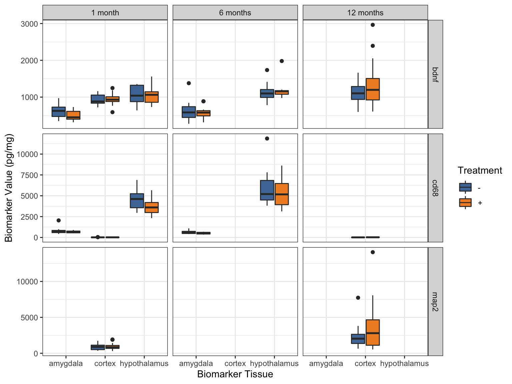

```{r}
#| label: setup
#| include: false
# The first chunk is special 
# because if you try to run a chunk below without running anything else first, 
# R will automatically run this first

knitr::opts_chunk$set(echo = TRUE, fig.path = "output_figs/")

# Here I am loading libraries/packages and installing packages you don't have yet. Add the argument `update=TRUE` if you want to update your packages.
pacman::p_load(
  vembedr,      # youtube embedder
  skimr,        # get overview of data
  tidyverse,    # data management + ggplot2 graphics 
  readxl,       # import Excel data
  gtsummary,    # summary statistics and tests
  ggthemes,     # lots of themes
  here,         # helps with file management
  janitor,      # for data cleaning, making tables
  palmerpenguins, # penguin data
  ghibli,       # studio ghibli palettes
  paletteer,    # additional ggplot2 palettes
  gt,           # beautiful tables
  rstatix,      # summary stats for numeric vars
  naniar        # missing values exploration
  )

# set ggplot theme for slides 
# theme_set(theme_bw(base_size = 22))
# theme_update(text = element_text(size=22))  # set global text size for ggplots

```


# Welcome to R Programming: Part 6!

Today we will practice wrangling messy data to prepare them for analysis.

<br>

Before you get started:

>Remember to save this notebook under a new name, such as `part_06_b526_YOURNAME.qmd`.

<br>

-   Load the packages in the setup code chunk

## Learning Objectives

-   **Practice** thinking through and planning ahead data wrangling steps to prepare a dataset ready for analysis
-   **Practice** working with real data
-   **Practice** cleaning variables
-   **Practice** merging datasets with `bind_rows` and `join`ing 
-   **Practice** making data long by `pivot`ing
-   **Practice** making complex visualizations with ggplot


# "Real data"

> Today's goal: wrangle messy data into something we can work with.

## Mouse data

* Today we are going to be working with a subset of real data that Dr. Minnier has analyzed. 
    *   The actual dataset had hundreds of columns (dozens of outcome variables, a few [biomarker](https://www.niehs.nih.gov/health/topics/science/biomarkers) values, hundreds of miRNA expression data, and lipidomics on a number of lipids). 
    *   The data we are using are a subset of the actual data with some random noise added to the values to protect the data privacy of the lab.

* Mouse data variables:
    - treatment (yes, no)
    - sex (male, female)
    - strain (genetic strain of mouse: [Balb/C](https://en.wikipedia.org/wiki/BALB/c), [C3H](https://www.criver.com/products-services/find-model/c3h-mouse?region=3611))
    - time point (1 month, 6 month, 12 month = age of mice)
    - two [miRNA](https://en.wikipedia.org/wiki/MicroRNA) expression values (micro ribonucleic acid, or microRNA)
    - biomarker values from three different brain tissues
    - outcomes of interest
        -  learning outcome (higher values are better)
        -  preference for object 1 and object 2 (from behavioral and cognitive tests on mice) which is measured in % time spent with that object. 

* The format of the Excel sheet is pretty similar to what was originally given, other than removing some columns.
    - One big change is that in the original data, each time point was a different cohort of mice, but we are pretending that it is the same cohort of mice and we have longitudinal data (actually impossible due to the way the biomarkers are measured, but let's just ignore that). This will allow you to practice more complex joins.


## Challenge 1 - group work!

The data are in `mouse_biomarker.xlsx` (4 different sheets (tabs) with data), which is in the data folder. __Open the data and look at the different sheets.__

1. Talk about what challenges to importing the data you anticipate, just by looking at them in Excel. _You are not yet loading the data in this step._
2. Look at the plot below. Based on the data in the Excel file, discuss what kind of data wrangling steps you would need to take to make this plot. *These can be somewhat vague ideas about what kind of columns you'd need in your wrangled dataset, not necessarily specific steps.* It might help to write out pseudo ggplot code, with elements (i.e. x axis, y axis, fill, facet) mapped to column names. _You still haven't loaded the data in this step!_
3. Try to read in the four sheets into R, saving them as data frames called `mouse_demo`, `mouse_tp1`, `mouse_tp2`, and `mouse_tp3`, respectively. Use `glimpse()` to look at how the data were read in and determine whether you were successful in reading in the data how you intended to.
4. How would you combine all these data into one dataset? Write out the steps, including any data cleaning/wrangling steps you need to do. 


{width="100%"}


# Read in the data

## Read in data files

::: {.panel-tabset}
### Key points

- Read in each Excel sheet separately
- Use `.name_repair` argument to clean the names somewhat and standardize the format
- Include "/" as a missing value
- Remove empty rows and columns (`janitor::remove_empty`)
- Check column types and names

### Code

```{r}
# .name_repair = make_clean_names is the same as applying clean_names() after reading in the data
# Note this is the same code for each, just the sheet number is changing

# sheet 1
mouse_demo <- read_excel(here::here("part6", "data","mouse_biomarker.xlsx"), 
                         sheet = 1,
                         .name_repair = janitor::make_clean_names) %>%
  remove_empty(which = c("rows","cols"))

# sheet 2
mouse_tp1 <-  read_excel(here::here("part6", "data","mouse_biomarker.xlsx"), 
                         sheet = 2, 
                         na = c("","/"),
                         n_max = 34,
                         .name_repair = janitor::make_clean_names) %>%
  remove_empty(which = c("rows","cols"))

# sheet 3
mouse_tp2 <-  read_excel(here::here("part6", "data","mouse_biomarker.xlsx"), 
                         sheet = 3, 
                         na = c("","/"),
                         .name_repair = janitor::make_clean_names) %>%
  remove_empty(which = c("rows","cols"))

# sheet 4
mouse_tp3 <-  read_excel(here::here("part6", "data","mouse_biomarker.xlsx"), 
                         sheet = 4, 
                         na = c("","/"),
                         .name_repair = janitor::make_clean_names) %>%
  remove_empty(which = c("rows","cols"))

glimpse(mouse_demo)
glimpse(mouse_tp1)
glimpse(mouse_tp2)
glimpse(mouse_tp3)

```

### Inspection

Things I notice:

- Column names "preference" and "x_4" aren't good/accurate names
- They are read in as characters because of the second header row "Obj 1" and "Obj 2"
- We need to remove that row, rename the columns, make those columns numeric
- We could do this to each individual dataset, or after combining them.
- Let's *combine* first
:::


## Challenge 2 - group work!

1. **_First, discuss the steps_** needed to combine the time point data. 
    -   Which datasets will you combine first, and how (which R function(s))?
2. **_Combine the data_**
    -   Combine the 3 time point datasets into one data frame (ignore demographic data for now) called `mouse_tp`. 
    -   Inspect the resulting data.
3. How would you create a table of the mouse id (`sid`) and time (i.e count how many data points we have for each mouse)?


```{r}
#| label: challenge2


```


# Combining time point data

## Stacking time point data with `bind_rows`

-   We can **bind** the three time points together 
    -   because while we have the same mice ids, we want to make this long format where the time point observations are in rows. 
-   Therefore, just stacking them on top of each other gives us the full set of time point data that we want to study. 


## try 1: 

-   We learned to bind two datasets at a time, but we can bind as many as we want:

```{r}
mouse_tp <- bind_rows(mouse_tp1, mouse_tp2, mouse_tp3)

glimpse(mouse_tp)
```

## try 2: Binding difficulties

-   Try 1 problem: we don't know which dataset came from which time point. 
    -   We need a time variable!
-   `bind_rows` has the option to give each dataset a "name" 
    -   and then tell bind rows to use that information to create a column with that name/label in it. 
-   In this case, we want the time points to be in a column called `time` (put this in the argument `.id = `).

The syntax is like this:

    df_all <- bind_rows("name1" = df1,
                        "name2" = df2,
                        "name3" = df3,
                        .id = "columnname")

So for our data, we use the time point to distinguish where each dataset came from:

```{r}
# use the name of the dataset to create an id variable time
mouse_tp <- bind_rows("tp1" = mouse_tp1, 
                      "tp2" = mouse_tp2,
                      "tp3" = mouse_tp3,
                      .id = "time")
mouse_tp %>%
  glimpse()

# what is this telling us?
mouse_tp %>% 
  tabyl(sid, time) %>% 
  adorn_title()
```


## try 3: ng vs pg

* The next issue is that binding these three together doesn't work as expected since we can see tp2 has ng/mg instead of pg/mg.
    * However,  it looks like this is a typo because they are on the same scale, not off by a factor of 1000 as we might expect based on the names.

```{r}
mouse_tp %>% 
  select(contains("cd68_amygdala"), contains("cd68_hypo")) %>%
  get_summary_stats() %>% 
  gt()
```


* Therefore, we should rename the columns of the `tp2` data before we bind. 
* We can use `rename()` as we have learned to rename those two columns individually, 
    * but there is also a function `rename_with()` that can take a function to apply, similar to the way we use functions in `across()`:

```{r}
colnames(mouse_tp2)

# repalce _ng with _pg in the column names
# note I tried replacing just "ng" with "pg", but then learning became learnipg!

mouse_tp2 <- mouse_tp2 %>%
  rename_with(.fn = ~str_replace(.x, "_ng", "_pg"))

colnames(mouse_tp2)
```

* Now we should be able to bind the three datasets together:

```{r}
mouse_tp <- bind_rows("tp1" = mouse_tp1, 
                      "tp2" = mouse_tp2,
                      "tp3" = mouse_tp3,
                      .id = "time") %>%
  # also rename the mirna columns for consistency
  rename(mirna1 = mirna_1,
         mirna2 = mi_rna_2)

mouse_tp %>%
  glimpse()
```


## Remove second preference header row 

Now let's deal with the preference column issues

- Data wrangling steps:
    - Rename the two columns `preference` and `x_4`
    - Set "Obj 1" and "Obj 2" to NA (use `na_if()`)
    - Convert those columns to numeric

```{r}
mouse_tp <- mouse_tp %>%
  # rename these two columns to make sense
  rename(preference_obj1 = preference,
         preference_obj2 = x_4)

colnames(mouse_tp)
```


```{r}
mouse_tp <- mouse_tp %>%
  mutate(
    # set Obj 1 and 2 to NA, 
    preference_obj1 = na_if(preference_obj1, "Obj 1"),
    preference_obj2 = na_if(preference_obj2, "Obj 2"),
    # then convert to numeric
    preference_obj1 = as.numeric(preference_obj1),
    preference_obj2 = as.numeric(preference_obj2)
  )

glimpse(mouse_tp)

# Note the NA row at the bottom!
mouse_tp %>% tabyl(sid, time)

```

-   Those rows that used to contain "Obj 1" and "Obj 2" are now almost empty:

```{r}
# when sid is NA,  the rest of the data is NA
# look at those rows:
mouse_tp %>% filter(is.na(sid))
```


## `drop_na()`

* We want to remove the three rows that have missing data in almost all columns,
    -   which is the same as removing rows with any missing data in `sid` (rows where `sid` = `NA`).

See Part5 notes and the [`drop_na()`](https://tidyr.tidyverse.org/reference/drop_na.html) reference for examples.

```{r}
# number of rows in complete data
mouse_tp %>% nrow

# use tidyr::drop_na() to remove those
# Note: remove_empty() from the `janitor` package won't remove them 
#  because `time` is not empty

# this removes rows were there is *any* missing data in *any* column
# complete cases only, we do not want this
mouse_tp %>% drop_na() %>% nrow

# this removes rows where there is missing data in sid
mouse_tp %>% drop_na(sid) %>% nrow

# save our work, remove just missing sid values
mouse_tp <- mouse_tp %>% 
  drop_na(sid)

```

Now we have exactly one time point for each `sid`:

```{r}
mouse_tp %>%
  tabyl(sid, time)
```

## Challenge 3 - group work!

1. Discuss what type of join would you use to combine the demographic data with the time point data and why. 
    -   Discuss how the joining of these two datasets is different than combining the three time point datasets we did above.
2. After discussing question 1, combine the demographic data with the time point data.
3. Create a column `time_month` that is a factor variable with levels "1 month", "6 months", and "12 months", in this order.
4. Revisit the plot below. What data wrangling steps do we still need to do to create this plot?


{width="100%"}

```{r}
# 2. combine the data


```


```{r}
# 3.  create time_month factor variable


```


# `join`: Combine demographic data with longitudinal time point data


## What type of `join`?

-   The demographic data `mouse_demo` provides the independent variables and experiment factors that are important for a future analysis.
-   Inspect the data to determine what type of join to use

<br>

-   Do we have "demographic" variables for all the id's in the time point biomarker data?

```{r}
mouse_demo$sid
mouse_tp$sid
```

-   How many unique id's are there in each dataset?

```{r}
n_distinct(mouse_demo$sid)
n_distinct(mouse_tp$sid)
```

* Both datasets have 32 unique id's, but are they the same 32 id's? 
    * We can check this with code!

_Do we have all the mouse demographic ids in our mouse biomarker (time point) data?_

```{r}
# is each mouse_demo id in mouse_tp id?
mouse_demo$sid %in% mouse_tp$sid

sum(mouse_demo$sid %in% mouse_tp$sid)
```

_Do we have all the time point ids in our mouse demographic data?_

```{r}
# is each mouse_tp id in mouse_demo id?
mouse_tp$sid %in% mouse_demo$sid

tabyl(mouse_tp$sid %in% mouse_demo$sid)
```

We do, they are just repeated for each time point!

>In this case, `left_join` and `full_join` and `inner_join` will all give the same result because we have the __same ids__ in both datasets.


## Do the `join`

```{r}
dim(mouse_demo)
dim(mouse_tp)
# joins by sid
mouse_data <- full_join(mouse_demo,
                        mouse_tp)

glimpse(mouse_data)
# View(mouse_data)
```

# Some more data wrangling

## Create time month factor

* Create a `time_month` variable that has the factor levels we want to recreate the figure:

```{r}
# create time_month factor
mouse_data <- mouse_data %>%
  mutate(time_month = case_when(
    time=="tp1" ~ "1 month",
    time=="tp2" ~ "6 months",
    time=="tp3" ~ "12 months"
  ),
  time_month = factor(
    time_month,
    levels = c("1 month", "6 months", "12 months")))

# check!!
mouse_data %>% tabyl(time_month, time) %>% 
  adorn_title()
```

## Object preference variables cleaning

::: {.panel-tabset}

### Problem?

* The two columns for object preference should add to 100%. 
    * However, there are some rows where the sum is 0%, 
    * that is a red flag--- actually both should be missing values. 

* How would you correct this and set these values to missing?

```{r}
mouse_data$preference_obj1 + mouse_data$preference_obj2
```

### Solution

* There are of course many ways to do this, but one way is:
    - Create a new column that is the sum of the two preference columns
    - When that sum is 0, set the two preference columns to `NA`

```{r}
# First create the column
mouse_data <- mouse_data %>%
  mutate(
    total_pref = preference_obj1 + preference_obj2
    ) 

# look at the rows where the sum is 0
mouse_data %>% 
  filter(total_pref==0) %>% 
  select(sid, time, contains("pref"))
```

* Below we use `case_when()` to mutate both columns, set to `NA` if `total_pref == 0` and otherwise (`.default`) use the value of that column
* We show two ways to do this, either:
    - one column at a time
    - or, `across` columns that start with "pref"


### Option 1

-   Mutate columns individually

```{r}
# we can mutate one column at a time:

mouse_data %>% mutate(
  preference_obj1 = case_when(
    total_pref == 0 ~ NA,
    .default = preference_obj1),
  
  preference_obj2 = case_when(
    total_pref == 0 ~ NA,
    .default = preference_obj2),
) %>% 
  
  # show a subset to see that it's working
  filter(sid%in%c(180, 181)) %>%
  select(sid, time, contains("pref"))
```


### Option 2

-   Mutate both columns simultaneously (& save our changes)

```{r}
# or both columns using across

mouse_data <- mouse_data %>%
  mutate(across(
    .cols = starts_with("pref"),
    .fns =  ~ case_when(
      total_pref == 0 ~ NA,
      .default = .)
    )) 


mouse_data %>%
  # show a subset to see that it's working
  filter(sid %in% c(180, 181)) %>%
  select(sid, time, contains("pref"))

```

### Remove `total_pref`

```{r}
# remove total_pref

mouse_data <- mouse_data %>% select(-total_pref)
```

:::


## Save the cleaned data as a file

* Now that we have the data cleaned and joined, 
    -   let's save this as a cleaned data file in case we want to use it later.

::: {.panel-tabset}

### csv file

-   Advantage: can look at the data in Excel
-   Disadvantage: we lose special "coding" of variables, such as factor variables (although we don't have any yet)

```{r}
write_excel_csv(
  mouse_data, 
  file = here::here("part6", "data", "mouse_data_longitudinal_clean.csv"))
```

### Rdata file

-   Advantage: we don't lose special "coding" of variables, such as factor variables (although we don't have any yet)

-   Disadvantage : can't look at the data in Excel

```{r}
save(
  mouse_data, 
  file = here::here("part6", "data", "mouse_data_longitudinal_clean.Rdata"))
```
:::

## Challenge 4

>__Make that plot__! _Or get as close as you can._

_Hint: you need to reshape your data and make some new columns out of old columns..._

{width="100%"}


```{r}
# make the data you need


# make your plot!


```


# Create the figure

## What do the data need to "look like" for the figure?

::: {.panel-tabset}

### Our data

Let's look at what we have again:

```{r}
glimpse(mouse_data)
```

### Variables needed to create the figure

* Our biomarker variables are in separate columns: 
    -   `normalized_bdnf_amygdala_pg_mg`,  `normalized_bdnf_cortex_pg_mg`, ... ,  `normalized_map2_cortex_pg_mg`.

* The plot has facets that correspond to 
    - biomarker (bdnf, cd68, map2) and 
    - tissue type (amygdala, cortex, hypothalamus). 

* Therefore, we need separate columns that contain this information, such as:
    - biomarker_type = bdnf, cd68, map2, etc
    - tissue_type = amygdala, cortex, hypothalamus, etc
    - biomarker_value = the biomarker numeric value for each of these

* Each mouse (`sid`) will have multiple rows, 
    - because they have multiple tissue samples and multiple biomarkers measured. 
    - This means we need "long" data, where each observation is in a separate row.

:::


## Make data long

First we will make the data long, and deal with the biomarker_type/tissue_type separation second:

```{r}
# make a long dataset where we have multiple biomarker data in the same column
mouse_biomarker_long <- mouse_data %>%
  pivot_longer(cols = starts_with("normalized"),
              names_to = "biomarker_type_temp",
              values_to = "biomarker_value")

glimpse(mouse_biomarker_long) # helps to View it too
```


We are getting there. 

* We now have the multiple observations per mouse (see `sid` 137 is repeated), 
    - and we have the `biomarker_value` column. 
* However, we need the `biomarker_type_temp` 
    - to be separated out into 
        - the tissue type and 
        - the name of the biomarker, 
    - for plotting purposes, and also to make it _tidy_!

## Tidy up `biomarker_type_temp` column

-   Goal: separate `biomarker_type_temp` into 2 columns:
    -   the tissue type and 
    -   the name of the biomarker

::: {.panel-tabset}


### `biomarker_type_temp`

* These are the values in the `biomarker_type_temp` column:

```{r}
mouse_biomarker_long %>% tabyl(biomarker_type_temp)
```


### Remove extra text

* First, we can remove the "normalized" and "pg_mg" parts:

```{r}
mouse_biomarker_long <- mouse_biomarker_long %>%
  mutate(
    biomarker_type_temp = str_remove_all(
      biomarker_type_temp, "normalized_|_pg_mg")
    )

# check:
mouse_biomarker_long %>% tabyl(biomarker_type_temp)
```

### Separate type and location

* Now we can separate using `separate_wider_delim()` with `_` as the separator:

```{r}
mouse_biomarker_long <- mouse_biomarker_long %>%
  separate_wider_delim(
    cols = biomarker_type_temp,
    names = c("biomarker_type", "biomarker_location"),
    delim = "_",
    cols_remove = FALSE)

glimpse(mouse_biomarker_long)
```

```{r}
# Check!
mouse_biomarker_long %>% 
  tabyl(biomarker_type_temp, biomarker_type) %>% 
  adorn_title()

mouse_biomarker_long %>% 
  tabyl(biomarker_type_temp, biomarker_location) %>% 
  adorn_title()
```

:::


## Make the plot!


::: {.columns}
                                        
::: {.column width="50%"}
```{r}
#| label: biomarker_boxplot
#| fig.width: 8.0
#| fig.height: 6.0

biomarker_boxplot <- ggplot(
  mouse_biomarker_long,
  aes(x = biomarker_location,
      y = biomarker_value,
      fill = trt)) +
  geom_boxplot() +
  facet_grid(
    cols = vars(time_month),
    rows = vars(biomarker_type),
    scales = "free_y") +
  theme_bw() +
  labs(x = "Biomarker Tissue",
       y = "Biomarker Value (pg/mg)",
       fill = "Treatment") +
  ggthemes::scale_fill_tableau()
```
:::
                                          
::: {.column width="50%"}

```{r}
#| fig.width: 10.0
#| fig.height: 8.0
#| echo: false

biomarker_boxplot
```

:::                                          
:::


# Save workspace as Rdata file

-   We're going to pick up in Part 7 where we left off here. 
-   In order to do that seamlessly and make sure we have all the objects in our workspace (environment) to access, we can save all the objects in our workspace in one `.Rdata` file

```{r}
save.image(file = here::here("part6", "workspace_part6.Rdata"))
```


# Package versions

-   I recommend adding the code below to the end of your files so that in the future you have a record of what versions of packages were used in your work. 

```{r}
devtools::session_info()
```


# Post Class Survey

Please fill out the [post-class survey](https://ohsu.ca1.qualtrics.com/jfe/form/SV_2f0SKdTYUo80aRo){target="_blank"}. 

Your responses are anonymous in that I separate your names from the survey answers before compiling/reading. 

You may want to review previous years' feedback [here](https://niederhausen.github.io/BSTA_526_W26/survey_feedback_previous_years){target="_blank"}.


# Acknowledgements

-   Part 6 is based on the BSTA 505 Winter 2023 course, taught by Jessica Minnier.
    -   I made modifications to update the material from RMarkdown to Quarto, and streamlined/edited content for slides.
    -   Also made changes such as using the new`separate_wider_delim()`, using `n_distinct()`, and saving `.Rdata` files.
-   Minnier's Acknowledgements:
    -   Written by Jessica Minnier and inspired by work of Ted Laderas.

