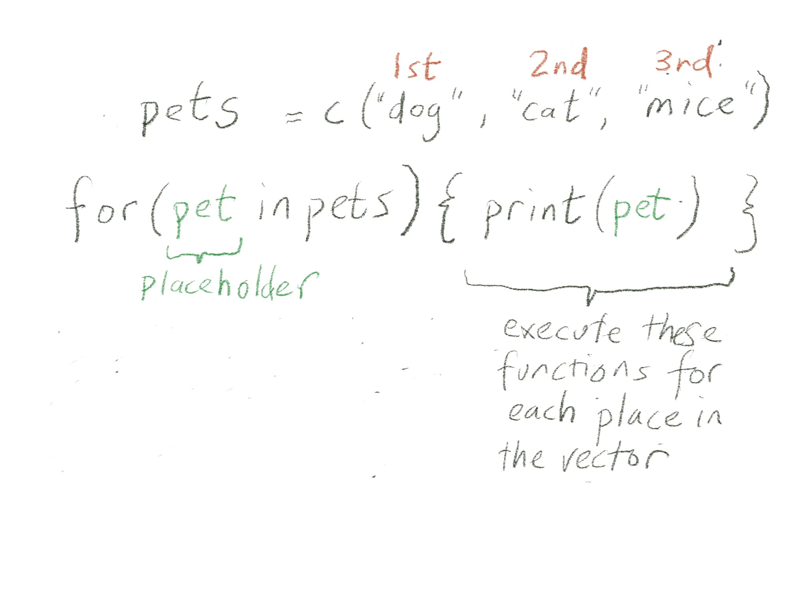
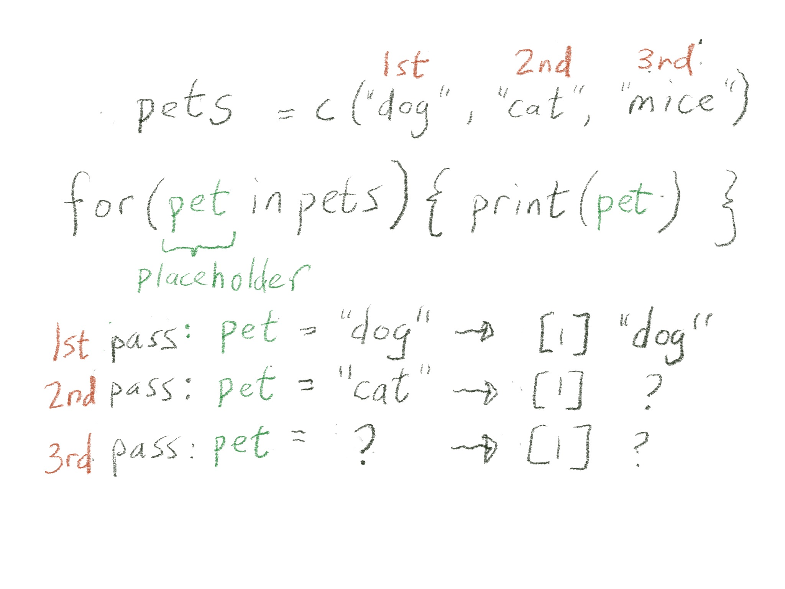
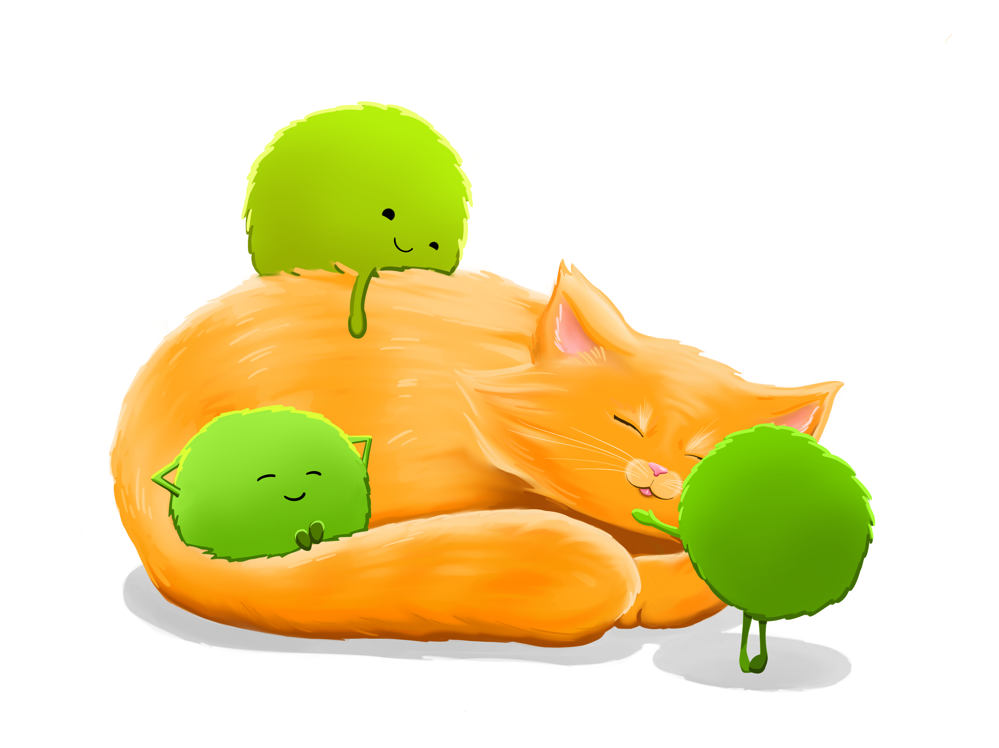

```{r}
#| label: setup
#| include: false
# The first chunk is special 
# because if you try to run a chunk below without running anything else first, 
# R will automatically run this first

knitr::opts_chunk$set(echo = TRUE, fig.path = "output_figs/")

# Here I am loading libraries/packages and installing packages you don't have yet. Add the argument `update=TRUE` if you want to update your packages.
pacman::p_load(
  vembedr,      # youtube embedder
  skimr,        # get overview of data
  tidyverse,    # data management + ggplot2 graphics 
  readxl,       # import Excel data
  gtsummary,    # summary statistics and tests
  ggthemes,     # lots of themes
  here,         # helps with file management
  janitor,      # for data cleaning, making tables
  palmerpenguins, # penguin data
  ghibli,       # studio ghibli palettes
  paletteer,    # additional ggplot2 palettes
  gt,           # beautiful tables
  rstatix,      # summary stats for numeric vars
  naniar,       # missing values exploration
  glue,          # strings
  broom         # for tidy-ing model output
  )

# set ggplot theme for slides 
# theme_set(theme_bw(base_size = 22))
# theme_update(text = element_text(size=22))  # set global text size for ggplots

```


# Welcome to R Programming: Part 9!

Today we will learn about iterating in R.

<br>

Before you get started:

>Remember to save this notebook under a new name, such as `part_09_b526_YOURNAME.qmd`.

<br>

-   Load the packages in the setup code chunk

## Learning Objectives

-   **Introduce** statistical modeling and *learn* how to fit a simple linear regression model and run a t-test in R
-   **Learn** how to use `broom` functions to tidy up statistical model output
-   **Learn** about `for` loops
-   **Understand** how to apply a function to a list
-   **Learn** how to iterate over a list using `map()` functions from the `purrr` package


# Brief Introduction to Statistics in R

-   A brief introduction on statistical models in R and how to extract output in a "tidy" way
-   We will be using statistical models as iteration examples and applying `purrr::map()`

## This is just a *brief* modeling overview!

-   This is not meant to be a comprehensive course in statistics!! 
-   Just showing some basic techniques.
-   If you want to learn more about statistical modeling, here are some resources:
    -   Modern Dive / Statistical Inference via Data Science by Chester Ismay and Albert Y Kim is a nice place to start: <https://moderndive.com/v2/>
    -   Danielle Navarro's Learning Statistics with R is excellent and talks much more about statistics: <https://learningstatisticswithr.com/>

*If you've worked with statistical models and tests in R, you know they have an...eclectic way of inputting data and outputting results. The inputs and outputs are not standardized or consistent.*

## Linear Regression

-   A linear regression model uses least squares estimation to fit the closest linear line to the model (very simplistic explanation). 
-   The linear regression formula is often written as:

$$Y = \beta_0 + \beta_1 \cdot X + error$$

-   $Y$ is a numeric continuous measurement (the "outcome" or "dependent variable")
-   $X$ is a covariate (or "predictor" or "independent variable"). 
    -   $X$ can be numeric or categorical (in R, this can be numeric, factor, character, or boolean). 
-   $\beta_0$ denotes the intercept of the line
-   $\beta_1$  denotes the slope of the line, or our coefficient. 
-   The error is assumed to normally distributed (Gaussian) with mean 0. 

## R formula for linear regression 

::: {.panel-tabset}
### Formula argument

-   In R, this translates to using a *formula argument* in the `lm()` function of the format `outcome ~ predictor` (the intercept is implied):

>`Y ~ X`

Or if we have multiple predictors/covariates (independent variables), perhaps:

>`Y ~ A + B + C`

### `lm()`

-   The function `lm()` is in the `stats` package, which is automatically loaded with every R session. 
    -   So you don't need to call `library(stats)` or `p_load(stats)` to use it.

### Example

-   Use the Palmer penguins data set
-   Outcome: `body_mass_g` (continuous)
-   Independent variables: `species` and `sex`

>`outcome ~ independent variables`  
>`body_mass_g ~ species + sex`


-   Categorical independent variables
    -   R converts categorical predictors, such as species and sex, into categories in the model
    -   The estimates are interpreted as the expected mean differences in body mass compared to the reference group. 
    -   The reference group is by default the first alphabetical category. 
        -   If you wish to change the reference group, you need to use factors.

-   If you have not taken BSTA 512/612, or a similar linear regression class, you can learn more about linear regression section in [Learning Statistics with R!](https://learningstatisticswithr.com/lsr-0.6.pdf).

### R code

Always read the documentation! `?lm`


```{r}
fit_lm <- lm(
  # formula: Y/dependent variable/outcome on left 
  # ~ X's independent variables on right
  body_mass_g ~ species + sex,
  data = penguins
)
```

-   This prints out the formula and the coefficient estimates, nothing else

```{r}
fit_lm
```

-   This prints out the coefficient estimates as well as statistics and p-values

```{r}
summary(fit_lm)
```

### Regression object

-   What kind of object is fit_lm?

```{r}
class(fit_lm)
```

-   Look at diagnostic plots

```{r}
# plot(fit_lm)
```

  -   What's in fit_lm?

```{r}
str(fit_lm)
```

### Coefficients

-   Extract coefficients from a list
    -   Remember `[["coefficients]]` is equivalent to `$coefficients` here.

```{r}
fit_lm$coefficients
```

-   Can use pluck to go deeper in the index

```{r}
fit_lm %>% pluck(coefficients, "sexmale")
```

:::

## Table of model estimates and p-values

-   Goal: Create a table with model estimates and p-values
    -   Add confidence intervals? 
-   `coef(summary(fit_lm))` and `confint(fit_lm)`) can be used
    -   ... but they are a bit of work and 
    -   not standardized across all the statistical methods/models 
    -   (*also, confusing, why do we need to use `coef` on the summary and `confint` on the original model? Who knows...*)

```{r}
coef(summary(fit_lm))
confint(fit_lm)
```

Enter `broom`!


## `broom` for `tidy()`-ing statistical output

::: {.panel-tabset}
### `broom` Overview

-   The `broom` package is truly a life changing package for statisticians.
-   3 main functions in *`broom`*:
    -   `tidy()` - most of the output you want, including *coefficients* and *p-values*
    -   `glance()` - additional model measures, including R-squared, log likelihood, and AIC/BIC
    -   `augment()` - make predictions with your model using new data

-   We will mostly use `tidy()` and `glance()` for right now.

### `tidy()`

-   Argument: a (regression) model object 
    -   many types of models or even simple tests work, such as t-test, etc. 
-   Output: a cleaned up tibble of model results

```{r}
tidy(fit_lm)
```

-   We can ask for confidence intervals:

```{r}
tidy(fit_lm, conf.int = TRUE)
```

-   We can save this tibble and make it prettier with tidyverse functions and gt:

```{r}
# save the tidy output
lm_tidy_output <- tidy(fit_lm, conf.int = TRUE)
```

Format p-value nicely with `scales::label_pvalue()`:

```{r}
# an example of using scales::label_pvalue to format p-value nicely
scales::label_pvalue(accuracy = 0.001)(0.2354464)
scales::label_pvalue(accuracy = 0.001)(0.00023)

# apply to lm output:
lm_tidy_output %>% 
  select(term, estimate, conf.low, conf.high, p.value) %>%
  mutate(
    # use the scales package to format the p-value nicely
    p.value = scales::label_pvalue(accuracy = 0.001)(p.value),
    # round numeric columns to 1 digit
    across(.cols = where(is.numeric),
           .fns = ~round(.x, digits = 1))
    ) %>%
  # use gt to make nice html table
  gt()
```

### `glance()`

-   Use `broom::glance()` to obtain model fit estimates, statistics, and tests.

```{r}
glance(fit_lm) %>% gt()
```

:::


## `gtsummary` package for statistical tables

-   The `gtsummary` package has several useful functions for creating nicely summarized output. 
-   Here's the regression table:

```{r}
tbl_regression(fit_lm)
```

-   If you prefer the global p-value for a multi-category covariate such as species:

```{r}
tbl_regression(fit_lm) %>%
  add_global_p(keep = TRUE)
```

-   There are many ways to use and customize these tables 
    -   that we will talk about in part 10.

## t-test (independent samples)

::: {.panel-tabset}
### Overview

-   Briefly, a (independent samples) t-test is used to test whether the means **between two groups** are different. 
    -   The measurements must be **numeric**.
    -   The *null* hypothesis for a t-test is that the two means are equal, and the *alternative hypothesis* is that they are not equal.
    -   See [Day 11](https://niederhausen.github.io/BSTA_511_F25/weeks/week_07.html) materials from BSTA 511 for more information.


### R code

-   The t-test formula in R is similar to a linear regression
    -   the continuous numerical measurement is on the left side of the `~` and 
    -   on the right side is the grouping variable.

-   Look at the `?t.test` documentation 
    -   to determine whether this is a two-sided t-test, and 
    -   whether it assumes the variances in each group are equal. 
    -   How would you perform a paired t-test?

```{r}
t.test(body_mass_g ~ sex, data = penguins)
```


-   The `t.test()` function can also be run using two vectors as inputs instead of a formula (`y~x`). 
-   Code below is for the same test as above, 
    -   creating two vectors of numeric data representing the values from each group (in this case, within each sex).

```{r}
# create first vector of values for females
female_body_mass_g <- penguins %>%
  filter(sex=="female") %>%
  # the pull function pulls out the column as a vector (not a data frame/tibble)
  pull(body_mass_g)

# create second vector of values for males
male_body_mass_g <- penguins %>%
  filter(sex=="male") %>%
  # the pull function pulls out the column as a vector (not a data frame/tibble)
  pull(body_mass_g)

# run t-test using the two vectors:
t.test(female_body_mass_g, male_body_mass_g)
```

### Model object

```{r}
# run a t-test, save the output
penguin_t <- t.test(body_mass_g ~ sex, data = penguins)

# t-test object is a complicated list
str(penguin_t)

```


### `broom::tidy()`

-   `broom::tidy()` pulls out all the relevant info, even the type of test!

```{r}
# use tidy to make output a tibble
broom::tidy(penguin_t) %>%
  gt()
```

-   Note that for the t-test, `glance` and `tidy` do the same thing because there's no model to summarize:

```{r}
broom::glance(penguin_t) %>% gt()
```

-   `estimate1` vs. `estimate2`: which mean is which?  
-   They will be listed in alphabetical order:

```{r}
penguins %>% 
  group_by(sex) %>%
  summarize(mean(body_mass_g))
```

-   *Stay tuned for more statistics and models next class.* 
    -   The purpose of this brief intro was to get started with doing stats in R so we can see how to use models with `purrr`.

:::

## Challenge 1

1.  Run a two sample t-test comparing cigarettes per day by gender variable in the `lusc_data.` Show the p-value using a function from `broom`.
2.  Fit a linear regression with cigarettes per day as the outcome and gender as the independent variable. Show the coefficients and p-value and confidence intervals using `broom`.

```{r}

```


# Iteration

-   From the [Iteration](https://r4ds.hadley.nz/iteration.html) chapter in *R4DS* (part of this week's readings)
    -   Iteration is "repeatedly performing the same action on different objects."

> Iteration in R generally tends to look rather different from other programming languages because so much of it is implicit and we get it for free. For example, if you want to double a numeric vector x in R, you can just write 2 \* x. In most other languages, you’d need to explicitly double each element of x using some sort of for loop.

-   Some examples of iteration that we've already seen:
    -   vectorized functions i.e. `2*x` or `toupper(c("a","b","cdef"))`
    -   `across()` with `mutate` or `summarize` performing calculations across multiple columns
    -   using custom functions within `across()`


## The `for()` loop way - first show iteration explicitly

::: {.panel-tabset}
### Motivation

-   The `for()` loop is a fundamental concept in computer programming. 
    -   This is the first step in automating over a long list (or vector!) of things.

-   The idea is: 
    -   If we do something once with a function, 
        -   we can do it multiple times on different elements in a vector with that function. 
    -   When we run the same function on different elements of a dataset, it is known as *iteration*.

[Wikipedia says:](https://en.wikipedia.org/wiki/For_loop)

> "In computer science a for-loop or for loop is a control flow statement for specifying iteration. Specifically, a for loop functions by running a section of code repeatedly until a certain condition has been satisfied."

-   In our case, the condition is usually that 
    - we've reached the end of the vector or list that we are indexing over. 
-   In the help documentation, `?for` definition is:
    -   `for(var in seq) {expr}`

### Examples

-   Below we *iterate* across the *vector* `1:10`.
-   The curly brackets `{}` 
    -   contain functions/code block that you want to apply to each value in the vector, or to each "step". 
    -   In this case, we're just printing out the values.


```{r}
# for each index in 1 to 10, do the thing inside {}
for(index in 1:10) {
  print(index)
}
```

-   Slightly more complicated
    -   *Note that you don't have to use the word `index` for the index!*

```{r}
# for each index in 1 to 10, do the thing inside {}
for(i in 1:10) {    # using i as the index
  print(i^2)
}
```

-   We can do many things inside the brackets:

```{r}
# for each index in 1 to 10, do the thing inside {}
for(numb in 1:10) {    # using numb as the index
  out <- numb - 1
  print(numb)
  print(out)
  print(numb + out)
}
```

### `index`

-   The `index` is a *placeholder*. 
-   It changes value each time we go through the loop (each iteration)
    -   It's a way to refer to the element of the list that time around. 
-   It is *not* a variable that is meant to be used outside of the for loop. 
    -   However, it *is* saved as an object (an aside: this is actually handy if your for loop exits on an error!):

```{r}
index
i
numb
```

-   You also don't need to use the index at all in your bracket code:

```{r}
# for each index in 1 to 10, do the thing inside {}
for(index in 1:10) {
  print(rnorm(n = 2))  # repeat the same thing 10 times
}
```

### Iterate over a character vector

```{r}
# for each index in the vector of pets, do the thing inside {}
pets <- c("dog", "cat", "mice")

for(index in pets) {
  print(index)
}
```

-   We can change the name of the index:

```{r}
# for each index in the vector of pets, do the thing inside {}
pets <- c("dog", "cat", "mice")

for(pet in pets) {
  print(pet)
}
```

### Visually

-   A visual explanation (via Ted Laderas)

{fig-align="center" width="70%"}  
{fig-align="center" width="70%"} 

:::

## Saving `for()` loop output

::: {.panel-tabset}
### Motivation

-   What does this `for()` loop do?

```{r}
pets <- c("dog", "cat", "mice")

for(pet in pets){
  mypet <- paste("meike's", pet)
  print(mypet)
}
```

-   Note that the last iteration of `mypet` is also saved as an object outside of the loop (into the global environment):

```{r}
mypet
```

-   But how do we capture all of the output the `for()` loop creates? 
    -   We need to save it explicitly as a vector or list.

### Saving output as a vector

-   Save all of the output the `for()` loop creates as a vector 
```{r}
# make an empty vector (initialize)
all_my_pets <- c()

for(pet in pets){
  mypet <- paste("meike's", pet)
  
  # add the new variable mypet to the end of the vector all_my_pets
  all_my_pets <- c(all_my_pets, mypet)
}

all_my_pets
```

-   What happens when you run the `for()` loop multiple times without initializing `all_my_pets`?

-   We know `all_my_pets` is a vector. 
    -   What does it contain? 
    -   What is its length?

```{r}


```


:::

## Challenge 2

-   The toy example below has vectors for 
    -   miles per gallon readings for different cars and 
    -   corresponding number of miles driven per day. 
-   The `for()` loop calculates the number of gallons (`ng`) used by each car.

1.    Adapt the code below to save the output as a vector of number of gallons driven for each car.
2.    Using the vector created in part 1, calculate the total number of gallons used.

```{r}
cars_mpg <- c(20, 30, 44.2, 10)
cars_miles <- c(10, 1, 50, 10)

# modify the for loop to save output as a vector:
for(index in seq_along(cars_mpg)) {
  ng <- cars_miles[index] / cars_mpg[index]
  print(ng)
}
```

How many total gallons of gas did the cars use?

```{r}

```

## `for()` loops with lists

We can also iterate `for()` loops over lists.

```{r}
my_list <- list(cat_names = c("Morris", "Julia"), 
                hedgehog_names = "Spiny", 
                dog_names = c("Rover", "Spot", "Kitty"),
                cat_ages = c(10,7))

```

-   Print the length of each list item

```{r}
for(index in my_list) {
  length(index) %>% print()
}
```

-   Print the first element of each list

```{r}
for(index in my_list) {
  index[[1]] %>% print()
}
```


## (Bonus content) Iteration over the length of the vector or list

-   It's also common to index over the numeric vector from 1 to the length of the list or vector:

```{r}
pets # reminder what pets looks like

for(index in 1:length(pets)) {
  str_to_upper(pets[index]) %>% print()
}

for(index in 1:length(my_list)) {
  print(index)
  print(my_list[[index]])
}

for(index in 1:length(my_list)) {
  myelement <- my_list[[index]]
  gg <- glue("The length of element {index} is: {length(myelement)}")
  print(gg)
}


```


# `purrr`: no need for for loops 🥳

{fig-align="center" width="75%"} 

## Motivation for `purrr`

-   `for()` loops can indeed be useful, but they have their pros and cons 
    -   (adapted from [Kelly Bodwin's lecture on iteration](https://www.youtube.com/watch?v=lq2a4m8TMYo))

-   Pros:
    -   Classic programming approach, easy to understand since each step is written out in order of operation (easier to teach, first!)
    -   Easy to adapt
    -   Somewhat easy to debug

-   Cons:
    -   Can become complex quickly, and therefore messy to read
    -   Require creating empty vectors and/or appending output in somewhat clunky way
    -   Don't fit "nicely" inside other functions or pipelines

## `purrr::map()`

::: {.panel-tabset}
### Overview

Enter the `purrr` package and `map()`.

-   `purrr::map()` lets us *apply a function* to each element of a list. 
-   It will always return a list with the number of elements that is the same as the list we input it with. 
-   Each slot of the returned list will contain the output of the functions applied to each element of the input list.

](image/purrr_cheatsheet_old_map.png){fig-align="center" width="100%"} 

-   The way to read a `map()` statement is:

>`map(.x = LIST_OBJECT, .f = FUNCTION_TO_APPLY)`


### Motiavting example

::: {.panel-tabset}
#### Function to iterate

-   Let's make a function to return the first element of the input vector:

```{r}
get_first_element <- function(input_vec){
  return(input_vec[1])
}
```

-   We can *apply this function to each element of a list*, if the list contains vectors. 
    -   This is usually easiest if the list is homogeneous, 
    -   but this specific function can work for heterogeneous lists containing different kinds of vectors as well.

#### `for` loop way

-   The `for` loop way is similar to the `for` loop where we printed the first element of the list on a previous slide:

```{r}
# create my list
my_list <- list(cat_names = c("Morris", "Julia"), 
                hedgehog_names = "Spiny", 
                dog_names = c("Rover", "Spot", "Kitty"),
                cat_ages = c(10,7))

# apply get_first_element to each element of my_list and save the output:

# create empty list
list_output <- list()

# for loop along the length of my list (in this case, 4)
for(index in 1:length(my_list)) {
  
  # print out the index just so we can see what index is
  print(index)
  
  # in the index'th slot, put in the first element of this list
  list_output[[index]] <- get_first_element(my_list[[index]])
}
# print out the result
list_output
```

-   That was....not simple. 
-   But `purrr::map()` gives us a much simpler way!


#### loop breakdown

-   First let's think about what the `for` loop was doing, 
    -   with a more straightforward approach, 
    -   but one that does not scale well:

```{r}
# apply the function directly to each list element one by one
list_output_by_hand <-
  list(
    get_first_element(my_list[[1]]),
    get_first_element(my_list[[2]]),
    get_first_element(my_list[[3]]),
    get_first_element(my_list[[4]])
  )

list_output_by_hand

# identical to output from for loop:
# list_output
```

-   Notice how we were *applying the function to each element of the list*, 
    -   one at a time, until we ran out of list elements? 
-   `purrr::map()` does this automatically, without writing out the function 4 (or many more) times.
:::

### `map()` 

-   The function `map()` usually takes two inputs:
    -   the list to process
    -   the function to process the list items with

>`map(.x = LIST_OBJECT, .f = FUNCTION_TO_APPLY)`

](image/purrr_cheatsheet_old_map.png){fig-align="center" width="100%"} 

### Example with `map()`

-   Here's the previous example using `map()` instead of using a `for` loop. 

```{r}
new_list <- map(.x = my_list, 
                .f = get_first_element)
new_list
```

-   We have the same output as above using a `for` loop, 
    -   but we even got to keep the original list names!
-   Note that we don't call `get_first_element()` with the parentheses 
        -   (similar to how we use functions by name in `across()` and/or `summarize()`)


-   We can also leave out the argument names for `map()` if we like:

```{r}
new_list <- map(my_list, get_first_element)
new_list
```

### Notes

-   By default, `map()` returns the results of your functions to a list.

-   `purrr::map()` will work on lists *or* vectors *or* data frames. 
    -   We're focusing on lists and vectors as input for now,
    -   because we have other ways of iterating across data frames (`summarize()` and `mutate()`, for example), and 
    -   I don't want to add too much confusion.

:::

## Challenge 3

-   Use `map()` to return the `length` of each of the elements in `my_list`.
    -   *Remember to not put the `()` after the function name.*

```{r}
#| eval: false
# switch eval to TRUE

my_list <- list(cat_names = c("Morris", "Julia"), 
                hedgehog_names = "Spiny", 
                dog_names = c("Rover", "Spot", "Kitty"),
                cat_ages = c(10,7))


my_lengths <- map(   )
my_lengths
```

## Passing in multiple parameters

-   When using a function such as `mean`, you might need to specify an argument for the function, such as `na.omit=TRUE`.

```{r}
my_list2 <- list(vec1 = c(10, 133, 1, NA), 
                 vec2 = c(11, 12, NA, 4), 
                 vec3 = c(1, 5, NA, 4, 100, 22)
)

# what happens without na.omit=TRUE?
map(.x = my_list2, .f = mean)
```

- How do we do we specify the function's arguments? 
    -   Very similar to how we did this in across:

```{r}
map(.x = my_list2, 
    .f = ~ mean(.x, na.rm=TRUE))
```

## Tidyverse way

We can also use the pipe with `map()`:

```{r}
my_list %>%
  map(get_first_element)
```

Meike's favorite `map()` example:

```{r}
# can be done with is.character as well
# penguins doesn't have character variables

penguins %>% select(where(is.factor)) %>% 
  map(tabyl)
```


## Help?! More on `purrr` iteration

-   [Learn to `purrr`](https://rebeccabarter.com/blog/2019-08-19_purrr) from Rebecca Barter's blog. This is a nice non-technical introduction to `purrr` and the various `map` variants.
-   Lessons in the [purrr tutorial](https://jennybc.github.io/purrr-tutorial/index.html) by Jenny Bryan.
-   The [`purrr` cheatsheet](https://github.com/rstudio/cheatsheets/blob/main/purrr.pdf) to learn more about the `purrr` package.

-   From [R for Data Science *first* edition](https://r4ds.had.co.nz/iteration.html) (section 21.4):

> The goal of using purrr functions instead of for loops is to allow you to break common list manipulation challenges into independent pieces:

1.   How can you solve the problem for a single element of the list? Once you’ve solved that problem, purrr takes care of generalising your solution to every element in the list.
2.   If you’re solving a complex problem, how can you break it down into bite-sized pieces that allow you to advance one small step towards a solution? With purrr, you get lots of small pieces that you can compose together with the pipe.

> This structure makes it easier to solve new problems. It also makes it easier to understand your solutions to old problems when you re-read your old code.

# `purrr::map()` with data frames

-   So far, we have used `purrr::map()` on a variety of simple lists. 
-   Now we're going to take a list of `data.frame`s and use `map()` and friends of `map()` to do something to each data frame in the list.

## Two `map()` examples

We're going to explore two examples of using `map()`. 

-   First example:
    1.  Write a function to run a statistical test on a data frame.
    2.  Use `map()` to apply that function to a list of data frames.

-   Second example (next class):
    1.  Take a `data.frame`, and split it into smaller `data.frame`s in a list.
    2.  Write a function that works on one of the slots in the list. In this case, we'll be building a linear model.
    3.  Use `map()` to apply that function to each of the smaller `data.frame`s in our list
    4.  Get the linear model results out and aggregate our results using a `data.frame`

## Example 1

::: {.panel-tabset}
### Load the datasets

-   Note that the data being read in are in the Part 8 folder!!

```{r}
lusc_data <- read_csv(here::here("part8", "data", "tumor", "LUSC.csv"))
meso_data <- read_csv(here::here("part8", "data", "tumor", "MESO.csv"))
prad_data <- read_csv(here::here("part8", "data", "tumor", "PRAD.csv"))
read_data <- read_csv(here::here("part8", "data", "tumor", "READ.csv"))
```

### List of datasets

-   Create a list of all the tumor data sets:

```{r}
my_data_list <- list("LUSC" = lusc_data, 
               "READ" = read_data, 
               "PRAD" = prad_data, 
               "MESO" = meso_data)
```

### t-test Function

-   Create a t-test function that 
    -   tests the difference in mean age at diagnosis
    -   between vital status 
    -   and `tidy` the output

```{r}
my_ttest <- function(mydata) {
  t.test(age_at_diagnosis ~ vital_status, 
         data = mydata) %>%
    tidy()
}

# apply my_ttest to one dataset:
my_ttest(lusc_data)
```

### `map()` the t-test   
    
-   Use `map()` to apply the t-test function we created to each dataset in the list:

```{r}
# Apply function to each element of list.
# Note the input/argument needs to be a data frame with the specified columns
tmpout <- map(.x = my_data_list, 
              .f = my_ttest)
tmpout

# str(tmpout)
```

:::

## Challenge 4

-   Create a similar function as `my_ttest` above that fits a linear regression instead of a t-test with the same outcome/group variables, and apply to the list of data sets using `map()`.

# Other `map` output types

-   By default, `map()` takes a list as an input and returns a list (named, if input is named). 
-   However, often it's useful to have one data frame or tibble as output. 


## Data frame output

::: {.panel-tabset}
### `list_rbind()` to convert list output $\to$ df

-   Recall that `tmpout` is the output from applying `map()` to our custom function `my_ttest`.
-   We can use the function `list_rbind()` to convert a list of data frames/tibbles to one tibble.
-   Use the argument `names_to` to create a column that contains the original names of the list elements so that we can tell which dataset the output came from.

```{r}
list_rbind(tmpout, names_to = "data_source") %>% 
  gt()
```

### `map_df()`

-   `map_df()` is a *superseded* `purrr` function that returns a data frame. 

```{r}
map_df(.x = my_data_list, 
       .f = my_ttest)
```

-   It essentially row binds the list output together. 
-   See the help file (?map_df) for the reasons it was put into lifecycle superseded.
-   It is now recommended to use `map()` together with `list_rbind()` instead.

:::


## Type-specific maps

::: {.panel-tabset}
### `map_xxx()`

Note that there are type-specific maps that return a vector of numeric values or whatever type you expect, such as

-   `map_int()` - returns an integer vector
    -   your function that you `map` should return an integer
-   `map_chr()` - function should return a character vector
    -   your function should return a character
-   `map_dbl()` - function should return a double (decimal) vector
    -   your function should return a `double`

The main difference between these is that they are *strict*: if you function doesn't return the desired data type, it will return an error.

### `map_int()` Examples

Recall `my_list`:

```{r}
my_list
```

-   Examples that return an integer vector:

```{r}
map_int(my_list, length)
map_int(my_data_list, nrow)
```

### `map_chr()` Examples

Examples that return a character vector.

-    *What's happening here?*

```{r}
map_chr(my_list, ~paste(.x, collapse = ", "))
```

-   *What's going on with this one?*

```{r}
map_chr(my_list, pluck(1))
```


:::

## Challenge 5

1a. Write a function that returns the first column name of a data frame.

1b. Apply this function to each of the data frames in `my_data_list` using a type-specific map from above.

2a. Write a function that takes a data frame as an argument and returns the first 3 rows. (Hint: remember `slice()`? or `head()` or `slice_head()`?).

2b. Apply this function using `map()` to `my_data_list` and return a stacked (row-wise) data frame of the first 3 rows of each element of the list, making sure to save the name of the data frame in a column called `source`.


```{r}


```


# Motivation for next time: using `map()` on split or nested data frames

-   Usually we are not working with a list of data frames that we've created ourselves. 
-   Often, we have one data frame and we want to perform the same operation on subsets of that data frame. 

## Example

::: {.panel-tabset}
### Description

-   For instance, we have a complete set of smoking/tumor data set in the data `smoke_complete`. 
-   We can perform our t-test 
    -   on each of the subsets defined by disease 
    -   by creating a "nested" data frame by disease, and 
    -   apply `map()` within `mutate()` to the sub data sets. -   We will go further into this useful method in the next class.

### Load data

```{r}
# Note the data are in the part8/data folder!
smoke_complete <- read_csv(here::here("part8", "data", "clinical.csv"))

glimpse(smoke_complete)

```

### Custom t-test function

```{r}
my_ttest <- function(mydata) {
  mydata <- mydata %>% mutate(yrs_diagnosis = age_at_diagnosis/365.25)
  t.test(yrs_diagnosis ~ vital_status, data = mydata) %>% tidy()
}

# check function works on one dataset:
smoke_complete %>%
  filter(vital_status %in% c("alive", "dead")) %>% 
  my_ttest()
```


### `group_nest()` 

-   Group the dataset by disease with `group_nest()`
-   *Notice the structure of the grouped tibble! *
    -   Each row of the tibble is for a different disease's data.

```{r}
grouped_smoke <- smoke_complete %>%
  filter(vital_status %in% c("alive", "dead")) %>%
  group_nest(disease) 

grouped_smoke
```

### Apply `map()` to grouped data

-   Apply `map()` via a `mutate()`.
-   Notice that each row (disease) has its own t-test output in the last column.

```{r}
grouped_smoke <- grouped_smoke %>%
  mutate(t_out = map(data, my_ttest))
grouped_smoke
```

### `unnest()` 

-   `unnest()` the grouped t-test output so that the t-test output for all of the diseased is "flat" in one tibble.
-   Specify which columns to unnest with the `cols` argument.

```{r}
grouped_smoke %>%
  select(-data) %>%
  unnest(cols = c(t_out)) %>%
  mutate(p.value = scales::label_pvalue()(p.value)) %>% 
  gt()
```


:::


# Post Class Survey

Please fill out the [post-class survey](https://ohsu.ca1.qualtrics.com/jfe/form/SV_2f0SKdTYUo80aRo){target="_blank"}. 

Your responses are anonymous in that I separate your names from the survey answers before compiling/reading. 

You may want to review previous years' feedback [here](https://niederhausen.github.io/BSTA_526_W26/survey_feedback_previous_years){target="_blank"}.


# Acknowledgements

-   Part 9 is based on the BSTA 505 Winter 2023 course, taught by Jessica Minnier.
    -   I made modifications to update the material from RMarkdown to Quarto, and streamlined/edited content for slides.

-   Minnier's Acknowledgements:
    -   Written by Jessica Minnier and Ted Laderas. 
    -   Some material inspired by [Kelly Bodwin's Adventures in R](https://www.adventures-in-r.com/post/05-loops-packages/).


