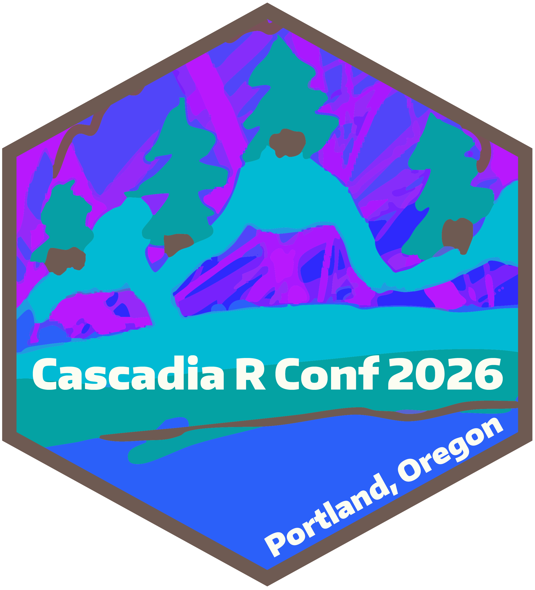

```{r setup, include=FALSE}
source(here::here("schedule_class_dates.R"))
```


## Topics

### Finish Part 6:

-   **Practice** thinking through and planning ahead data wrangling steps to prepare a dataset ready for analysis
-   **Practice** working with real data
-   **Practice** cleaning variables
-   **Practice** merging datasets with `bind_rows` and `join`ing 
-   **Practice** making data long by `pivot`ing
-   **Practice** making complex visualizations with ggplot

### Part 7: 

-   **Learn** new options for customizing tables
-   **Practice** modifying factor levels
-   **Practice** ggplot and **Learn** more geometries

## Announcements

::: {.columns}
                                        
::: {.column width="70%"}
-   The [**Midterm**]{style="color:darkorange"} is posted on [OneDrive](https://ohsuitg-my.sharepoint.com/my?id=%2Fpersonal%2Fniederha%5Fohsu%5Fedu%2FDocuments%2Fteaching%2FBSTA%20526%2FW26%2FBSTA%5F526%5FW26%5Fclass%5Fmaterials%5Fpublic%2Fmidterm&viewid=f39696a4%2D6b6c%2D4d5a%2Db1d1%2D6b17a205bb96). It is due Sunday 2/22/26.
    -   Please start early on this since finding a suitable dataset might take some time.
    -   I encourage you to meet with me to discuss your research question and data, to make sure you are on the right track. 

-   **Functions of the Week**
    -   [Signup sheet](https://ohsuitg-my.sharepoint.com/:x:/r/personal/niederha_ohsu_edu/_layouts/15/Doc.aspx?sourcedoc=%7BBAE3FF1C-3623-437E-B2DB-C057EC36BF7B%7D&file=signup_functions_of_the_week_2026.xlsx&action=default&mobileredirect=true) for your functions of the week presentations. The file is in OneDrive in the [functions_of_the_week folder](https://ohsuitg-my.sharepoint.com/my?id=%2Fpersonal%2Fniederha%5Fohsu%5Fedu%2FDocuments%2Fteaching%2FBSTA%20526%2FW26%2FBSTA%5F526%5FW26%5Fclass%5Fmaterials%5Fpublic%2Ffunctions%5Fof%5Fthe%5Fweek&viewid=f39696a4%2D6b6c%2D4d5a%2Db1d1%2D6b17a205bb96). 
    -   Presentations will be during weeks 5-10. *Please no more than 4 presentations per week.* 
    -   If there is a function you are interested in presenting that is not on the signup sheet, please check with me. If it hasn't been covered before and isn't covered in the class, then most likely I will approve it. 


-   [**Cascadia R Conf**](https://cascadiarconf.com/) in June 26-27 this year. It will be held at OHSU in RLSB. This is a great conference to meet other R enthusiasts in the area and learn more about what they are working on. 
:::
                                          
::: {.column width="30%"}
{fig-align="center" width="60%"}
:::
                                          
:::

## Class materials

-   Class materials in OneDrive folder [BSTA_526_W26_class_materials_public](https://ohsuitg-my.sharepoint.com/my?id=%2Fpersonal%2Fniederha%5Fohsu%5Fedu%2FDocuments%2Fteaching%2FBSTA%20526%2FW26%2FBSTA%5F526%5FW26%5Fclass%5Fmaterials%5Fpublic).
-   For today's class, make sure to download to your computer the folder called `part7`. 
-   *Open RStudio by double-clicking on the project file called `BSTA_526_W26_class_materials_public.Rproj` in the main OneDrive folder.*

<br>

-   We will first finish the Week 6 slides, starting with [Section 4.7: Challenge 3](https://niederhausen.github.io/BSTA_526_W26/part6/part_06_b526_slides.html#/challenge-3---group-work).


<!-- -   [Link to Sakai](https://sakai.ohsu.edu/portal/site/BSTA-526-1-21029-W26/tool/0a1dc228-11f3-4ae0-a5d1-1d4597c01180/ShowPage?sakai.tool.placement.id=0a1dc228-11f3-4ae0-a5d1-1d4597c01180) for link to Week 6 group work files -->


| Part | OneDrive folder | Slides | Webpage |
|--------------|--------------|--------------|--------------------------------|
| 6 | [](https://ohsuitg-my.sharepoint.com/my?id=%2Fpersonal%2Fniederha%5Fohsu%5Fedu%2FDocuments%2Fteaching%2FBSTA%20526%2FW26%2FBSTA%5F526%5FW26%5Fclass%5Fmaterials%5Fpublic%2Fpart6) | [](../part6/part_06_b526_slides.qmd) | [](../part6/part_06_b526.qmd) |
| 7 | [](https://ohsuitg-my.sharepoint.com/my?id=%2Fpersonal%2Fniederha%5Fohsu%5Fedu%2FDocuments%2Fteaching%2FBSTA%20526%2FW26%2FBSTA%5F526%5FW26%5Fclass%5Fmaterials%5Fpublic%2Fpart7) | [](../part7/part_07_b526_slides.qmd) | [](../part7/part_07_b526.qmd) |

<!-- : {.striped .hover tbl-colwidths="\[3, 4, 4, 4\]"} -->


## Readings


### Optional

*Note: These were original listed as the Week 6 Optional readings. They actually more closely relate to the Week 7 material and thus I moved them to Week 7.*

-   [`tabyl`](https://cran.r-project.org/web/packages/janitor/vignettes/tabyls.html) vignette: learn about the various `adorn` options
-   [`gt`](https://gt.rstudio.com/) package: learn more about creating customized tables with various `gt` options
-   [`gtsummary`](https://www.danieldsjoberg.com/gtsummary/) package: great for creating summary tables (Table 1); a companion package to `gt`
    -   I recommend starting with the [`tbl_summary()`](https://www.danieldsjoberg.com/gtsummary/articles/tbl_summary.html) tutorial


## Post-class survey

* Please fill out the [post-class survey](https://ohsu.ca1.qualtrics.com/jfe/form/SV_2f0SKdTYUo80aRo) to provide feedback. Thank you!
* Previous muddiest points and clearest points with responses are collected  [here](../survey_feedback_previous_years.qmd).

## Homework

* See OneDrive folder for homework assignment.
* HW 7 due on `r format(w7d1, "%m/%d")`.

## Recording

* __In-class__ recording links are on [Sakai](https://sakai.ohsu.edu/portal/site/BSTA-526-1-21029-W26/tool/0a1dc228-11f3-4ae0-a5d1-1d4597c01180/ShowPage?returnView=&studentItemId=0&backPath=&bltiAppStores=false&errorMessage=&clearAttr=&messageId=&source=&title=&newTopLevel=false&sendingPage=232002&postedComment=false&addBefore=&itemId=5509813&path=push&reviewAssessment=false&topicId=&addTool=-1&recheck=&id=&forumId=). Navigate to _Course Materials_ -> _Schedule with links to in-class recordings_. 


